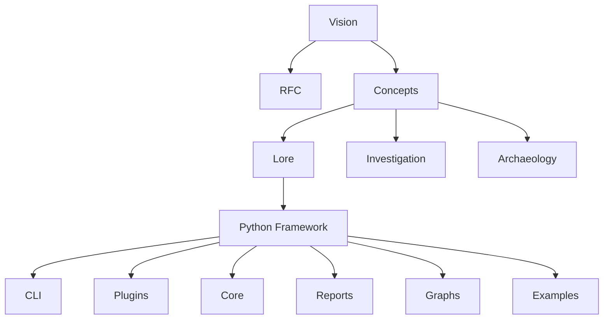

# Chapitre 2 — Anatomie du dépôt : Quand l'architecture raconte une philosophie

> *« Une bonne architecture ne se contente pas d'organiser des fichiers ; elle révèle la manière dont ses concepteurs pensent le problème qu'ils cherchent à résoudre. »*

---

# Une première impression trompeuse

Lorsque l'on ouvre le dépôt Searchlores pour la première fois, il ressemble à beaucoup d'autres projets Python.

On y retrouve les éléments habituels :

* un `README.md` ;
* des dossiers Python ;
* quelques fichiers de configuration ;
* des exemples ;
* des scripts d'installation.

Pourtant, cette impression disparaît rapidement.

Contrairement à un framework classique, le dépôt ne se contente pas de contenir du code : il renferme également une **théorie**. Les RFC, les manifestes et les documents de conception occupent une place presque aussi importante que les modules Python eux-mêmes.

Autrement dit, Searchlores ne sépare pas la réflexion de l'implémentation. La documentation n'est pas un simple complément ; elle fait partie intégrante du système.

---

# Une architecture en couches

En observant l'organisation générale, on distingue rapidement plusieurs niveaux de responsabilité.



Cette représentation est importante.

Dans la plupart des frameworks modernes, la couche supérieure est le code.

Dans Searchlores…

le code apparaît presque comme la conséquence logique des concepts.

---

# Le dépôt comme livre

On pourrait presque découper Searchlores en trois ouvrages distincts.

## Premier livre : la philosophie

Cette partie contient les textes expliquant :

* pourquoi Searchlores existe ;
* ce qu'est une Investigation ;
* ce que signifie "Lore" ;
* pourquoi la recherche est considérée comme une discipline intellectuelle.

Elle répond à la question :

> **Pourquoi ce framework ?**

---

## Deuxième livre : la spécification

Les RFC décrivent :

* les futurs composants ;
* les mécanismes envisagés ;
* les interfaces ;
* les comportements attendus.

Nous ne sommes plus dans le code.

Nous sommes dans la conception.

Cette partie ressemble davantage à ce que l'on trouverait dans un projet comme Kubernetes ou Rust.

---

## Troisième livre : l'implémentation

Enfin vient le framework Python.

Il matérialise progressivement les idées présentées auparavant.

Certaines sont déjà totalement implémentées.

D'autres ne sont encore que des prototypes.

Cette distinction sera essentielle tout au long de cette monographie.

---

# Une architecture orientée domaine

Beaucoup de projets Python utilisent une organisation technique.

Par exemple :

```text
api/

models/

utils/

database/

services/
```

Searchlores adopte une approche différente.

Ses dossiers représentent principalement des **concepts métier**.

Autrement dit, la structure du dépôt reflète la manière dont les auteurs pensent une enquête.

On y rencontre ainsi des notions telles que :

* Investigation
* Lore
* Archaeology
* Narrative
* Context
* Evidence
* Graph

Ce ne sont pas des composants techniques.

Ce sont des objets cognitifs.

---

# Le cœur conceptuel

À mesure que l'on explore le code, une idée devient évidente.

Le projet ne manipule presque jamais directement :

* des prompts,
* des conversations,
* des messages.

Il préfère travailler avec des objets beaucoup plus riches.

Une investigation devient un ensemble comprenant :

```text
Sujet

↓

Questions

↓

Hypothèses

↓

Indices

↓

Relations

↓

Preuves

↓

Narration

↓

Conclusion
```

Cette granularité est très inhabituelle dans le monde des frameworks LLM.

---

# La séparation des responsabilités

Une caractéristique remarquable de Searchlores est la netteté de ses frontières internes.

On peut distinguer plusieurs grandes familles de composants.

## Le Core

Le Core constitue le socle du framework.

Il est responsable :

* du cycle de vie d'une investigation ;
* des objets fondamentaux ;
* des interfaces internes ;
* de l'orchestration générale.

Le Core ne connaît pas les détails des plugins ni des interfaces utilisateur. Il définit le langage commun du système.

---

## Le système Lore

Le Lore joue un rôle particulier.

Il représente la mémoire conceptuelle.

Contrairement à une simple base documentaire, il décrit des connaissances structurées, réutilisables et contextualisées.

On peut le considérer comme une couche située entre :

* la mémoire ;
* la documentation ;
* la modélisation de domaine.

---

## Les modules d'archéologie

Ces modules sont probablement les plus originaux.

Ils cherchent à reconstruire :

* l'origine d'une idée ;
* son évolution ;
* ses transformations ;
* ses influences.

Le projet ne traite donc jamais une information comme un fait isolé.

Chaque donnée possède une profondeur historique.

---

## Les plugins

Les plugins permettent d'étendre le framework.

Ils encapsulent :

* de nouvelles méthodes d'analyse ;
* de nouveaux connecteurs ;
* de nouveaux formats ;
* de nouvelles investigations.

L'architecture privilégie ainsi l'extension plutôt que la modification du cœur.

---

## Les outils de visualisation

Une investigation produit naturellement un réseau de relations.

Searchlores intègre donc des mécanismes destinés à représenter ces relations sous forme de graphes, de cartes ou de diagrammes.

Cette capacité est cohérente avec l'objectif du projet : rendre visibles les structures découvertes au cours d'une enquête.

---

# Une architecture inspirée des sciences humaines

Un détail saute aux yeux.

La plupart des frameworks IA empruntent leur vocabulaire à l'informatique.

Searchlores, lui, emprunte son vocabulaire :

* à l'histoire ;
* à l'archéologie ;
* à la philosophie ;
* à la recherche documentaire ;
* à la linguistique ;
* aux sciences cognitives.

Cette différence n'est pas cosmétique.

Elle influence directement la structure du code.

---

# Les flux ne sont pas linéaires

Dans beaucoup de frameworks, l'exécution suit un pipeline.

```text
Prompt

↓

LLM

↓

Réponse
```

Searchlores fonctionne davantage comme une exploration.


On remarque immédiatement la présence d'une boucle.

Les découvertes alimentent les hypothèses.

Les hypothèses orientent les recherches.

La recherche devient donc itérative.

---

# Une forte séparation entre connaissance et exécution

C'est probablement l'une des meilleures décisions architecturales du projet.

Les connaissances ne sont pas mélangées :

* avec les plugins ;
* avec les LLM ;
* avec l'orchestration.

Chaque couche possède sa responsabilité propre.

Cela facilite :

* l'évolution du framework ;
* le remplacement des modèles ;
* l'ajout de nouveaux moteurs ;
* la réutilisation des connaissances.

---

# Une architecture pensée pour durer

En parcourant les différents modules, on remarque un effort constant pour éviter le couplage fort.

Les composants communiquent principalement via :

* des interfaces ;
* des objets métier ;
* des représentations abstraites.

Cette approche laisse présager une volonté de faire évoluer Searchlores sur plusieurs années sans remettre en cause ses fondations.

---

# Une première lecture critique

À ce stade, il est déjà possible de tirer quelques conclusions.

## Les points forts

Le projet se distingue par une vision particulièrement cohérente. Chaque composant semble répondre à une intention intellectuelle clairement formulée, et l'ensemble dégage une identité forte. La séparation entre les concepts, la logique métier et l'infrastructure est généralement bien pensée, ce qui favorise l'extensibilité et la lisibilité.

## Les défis

Cette richesse conceptuelle a cependant un coût. Pour un nouveau venu, le dépôt peut sembler déroutant : la quantité de documents, de notions originales et de références théoriques demande un véritable temps d'appropriation. L'architecture ne se révèle pleinement qu'après plusieurs lectures croisées entre le code et les RFC.

---

# Ce que nous apprend cette anatomie

À ce stade de notre exploration, une idée s'impose : Searchlores n'est pas un simple framework Python auquel on aurait ajouté quelques abstractions originales. C'est un projet conçu **de l'idée vers le code**, et non l'inverse.

Le dépôt raconte ainsi une histoire en trois temps :

1. une vision de la recherche comme discipline intellectuelle ;
2. une formalisation de cette vision sous forme de concepts et de spécifications ;
3. une implémentation progressive dans un framework extensible.

Comprendre cette progression est essentiel, car elle explique la plupart des choix architecturaux que nous allons maintenant examiner de plus près.

Dans le prochain chapitre, nous quitterons la vue d'ensemble pour entrer au cœur du code. Nous dresserons une cartographie détaillée de chaque répertoire, analyserons les responsabilités de chaque package et montrerons comment les différentes briques collaborent pour donner vie au moteur d'investigation de Searchlores. C'est à partir de cette anatomie fine que l'on commencera réellement à comprendre le fonctionnement interne du framework.
