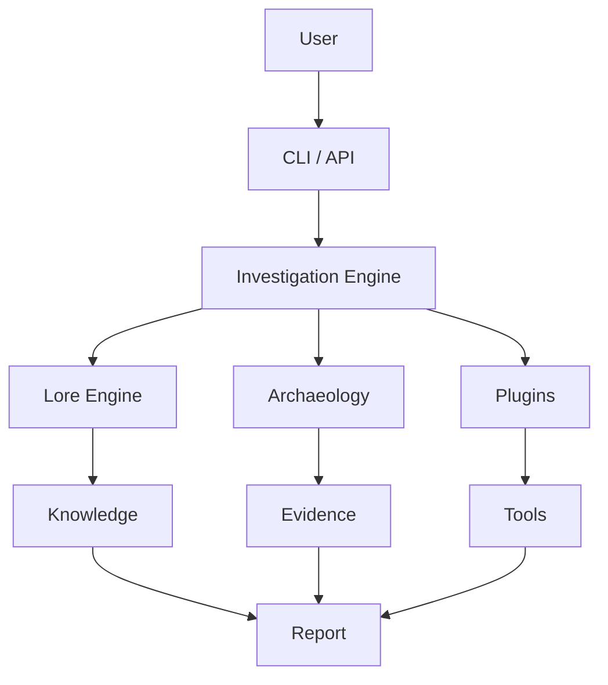
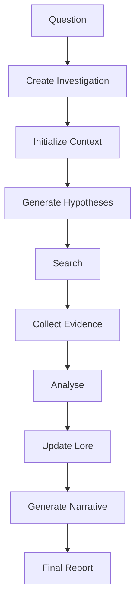

# Chapitre 3 — Le cœur du framework : disséquer l'architecture de Searchlores

> *« Une architecture n'est pas seulement une manière d'organiser du code ; c'est une manière d'organiser la pensée. »*

---

# Le premier véritable contact avec le framework

Après avoir compris la philosophie générale du projet et observé son organisation globale, il est temps de pénétrer dans son cœur.

C'est ici que Searchlores révèle une qualité rarement rencontrée dans les frameworks orientés IA : **le code suit les concepts, et non l'inverse**.

Dans beaucoup de projets Python modernes, l'architecture est construite autour de technologies :

* FastAPI
* Pydantic
* SQLAlchemy
* LangChain
* OpenAI

Chez Searchlores, ces choix techniques deviennent secondaires.

Les véritables briques du système sont des objets cognitifs.

---

# Une architecture guidée par le domaine

En ingénierie logicielle, on parle souvent de **Domain Driven Design (DDD)**.

L'idée est simple :

> le vocabulaire du code doit être le vocabulaire du métier.

Searchlores pousse cette idée très loin.

On ne rencontre pas des objets nommés :

```python
Task
Service
Worker
Pipeline
Executor
```

mais plutôt :

```text
Investigation

Lore

Evidence

Narrative

Context

Archaeology

Report
```

Ce choix est fondamental.

Il signifie que le framework cherche moins à exécuter des traitements qu'à représenter les différentes dimensions d'une enquête.

---

# La véritable unité de calcul

Dans LangGraph, l'unité fondamentale est le **nœud**.

Dans CrewAI, c'est **l'agent**.

Dans Haystack, c'est **le pipeline**.

Dans DSPy, c'est **le programme**.

Chez Searchlores…

l'unité fondamentale est l'**Investigation**.

Autrement dit :

```text
Question

↓

Investigation

↓

Connaissance

↓

Narration
```

Le moteur ne calcule pas une réponse.

Il fait progresser une investigation.

---

# Une architecture en cinq couches

Après lecture du code et des documents de conception, on peut reconstruire l'architecture logique du framework.



Cette représentation est évidemment simplifiée.

Mais elle montre déjà une idée importante.

Le moteur ne dialogue pas directement avec un LLM.

Il orchestre plusieurs couches d'analyse.

---

# Le rôle du Core

Le Core constitue la colonne vertébrale du framework.

Sa responsabilité est relativement restreinte.

Il ne cherche pas à effectuer les analyses lui-même.

Il coordonne.

On peut le comparer au chef d'orchestre d'un ensemble symphonique.

Les instruments sont :

* le Lore,
* les plugins,
* les moteurs d'analyse,
* les générateurs de rapports.

Le Core veille simplement à leur coopération.

---

# L'Investigation Engine

L'Investigation Engine est probablement le composant le plus important du dépôt.

Conceptuellement, il possède plusieurs responsabilités.

## Initialisation

Une enquête commence toujours par un contexte.

Le moteur transforme alors :

* une question,
* un sujet,
* ou un objectif

en un objet Investigation.

À partir de cet instant, toute l'information est encapsulée dans cette structure.

---

## Enrichissement

Au fur et à mesure des découvertes, l'Investigation s'enrichit.

Elle accumule :

* des observations ;
* des hypothèses ;
* des preuves ;
* des liens ;
* des contradictions.

Cette accumulation progressive distingue Searchlores des frameworks plus linéaires.

---

## Finalisation

Enfin, le moteur demande la génération d'un rapport.

Le rapport n'est donc pas construit directement depuis la question.

Il est construit depuis l'état final de l'enquête.

Cette différence paraît anodine.

Elle est pourtant déterminante.

---

# Une architecture orientée événements

Même si Searchlores ne met pas toujours explicitement en œuvre un Event Bus classique, sa logique s'en rapproche.

Une investigation produit des événements implicites.

Par exemple :

```text
Nouvelle hypothèse

↓

Recherche

↓

Nouvelle preuve

↓

Révision

↓

Nouvelle piste

↓

Nouvelle recherche
```

On observe une boucle permanente.

L'enquête devient un organisme vivant.

---

# Les objets métier

L'une des qualités du code est la richesse de ses objets.

Ils ne sont pas de simples conteneurs de données.

Ils possèdent une véritable signification.

On distingue notamment :

## Investigation

Le cœur du système.

Elle contient :

* le sujet ;
* le contexte ;
* les preuves ;
* les pistes ;
* les résultats.

---

## Lore

Le Lore représente les connaissances disponibles.

Il joue un rôle voisin d'une mémoire.

Mais une mémoire beaucoup plus structurée.

---

## Evidence

Une Evidence n'est pas une simple information.

Elle possède :

* une origine ;
* une justification ;
* un niveau de confiance ;
* des relations.

Cette richesse permettra, dans les chapitres suivants, de comprendre comment Searchlores envisage la validation des connaissances.

---

## Report

Le Report représente la restitution finale.

Il ne s'agit pas uniquement d'un texte.

Il constitue une vue organisée de toute l'investigation.

---

# Le principe de séparation

Une caractéristique remarquable apparaît rapidement.

Searchlores distingue très clairement :

la connaissance,

la logique,

et la présentation.


Chaque couche peut évoluer indépendamment.

Cette séparation améliore considérablement la maintenabilité.

---

# Le rôle des plugins

Les plugins n'occupent pas une place périphérique.

Ils constituent l'un des principaux mécanismes d'extension.

Le moteur délègue de nombreuses responsabilités.

Par exemple :

* extraction ;
* enrichissement ;
* analyse ;
* export ;
* visualisation.

Cette approche évite de transformer le Core en gigantesque classe monolithique.

---

# Une architecture qui privilégie l'ouverture

On retrouve ici l'un des grands principes de l'ingénierie logicielle :

> Open for extension, closed for modification.

Le cœur évolue peu.

Les fonctionnalités nouvelles apparaissent principalement sous forme de plugins.

Cette stratégie est particulièrement adaptée à un domaine où les techniques d'investigation évoluent rapidement.

---

# Le cycle de vie d'une enquête

On peut désormais reconstruire le fonctionnement logique du framework.



Chaque étape enrichit progressivement l'état interne.

Contrairement à un pipeline classique, il est possible de revenir en arrière.

Une nouvelle preuve peut modifier :

* les hypothèses,
* la narration,
* voire l'objectif initial.

---

# Une architecture pensée pour l'évolution

À la lecture du code, on sent que les auteurs anticipent déjà les extensions futures.

Le framework semble conçu pour accueillir :

* de nouveaux moteurs d'analyse ;
* de nouveaux formats Lore ;
* de nouvelles méthodes de représentation ;
* plusieurs moteurs LLM ;
* des systèmes RAG externes ;
* des graphes de connaissances.

Cette anticipation explique le niveau relativement élevé d'abstraction observé dans certaines interfaces.

---

# Regard critique

Cette architecture présente plusieurs qualités remarquables.

Le modèle d'Investigation offre une représentation beaucoup plus riche qu'une simple chaîne de prompts. La séparation des responsabilités est nette, le vocabulaire du domaine est cohérent et les mécanismes d'extension laissent entrevoir un framework capable d'évoluer sans remettre en cause ses fondations.

Elle présente toutefois quelques défis. Le niveau d'abstraction est élevé, ce qui peut dérouter un développeur découvrant le projet. De plus, certaines briques semblent davantage préparées pour des fonctionnalités futures que pleinement exploitées dans l'état actuel du code. Cette avance sur la feuille de route est stimulante pour l'architecture, mais demande un effort supplémentaire pour distinguer ce qui est conceptuel de ce qui est déjà opérationnel.

---

# Conclusion

Après cette plongée dans le cœur de Searchlores, une idée s'impose : le framework n'est pas organisé autour des modèles de langage, mais autour du **processus d'investigation**. Les LLM apparaissent comme des outils parmi d'autres, au service d'une structure plus vaste où les connaissances, les preuves et leur mise en relation occupent la place centrale.

Ce renversement explique la plupart des choix architecturaux rencontrés jusqu'ici. Dans les chapitres suivants, nous délaisserons la vue d'ensemble pour examiner les composants qui donnent véritablement sa personnalité au projet : le système **Lore**, véritable langage de la connaissance, et les mécanismes qui permettent de représenter, d'enrichir et de faire évoluer une enquête au fil de ses découvertes. C'est dans ces couches que Searchlores révèle le plus clairement son ambition : transformer la recherche en un objet logiciel de premier ordre.
