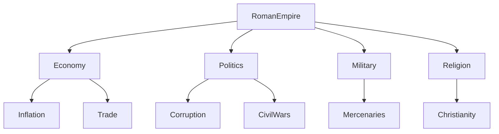

# Chapitre 4 — Le Lore : lorsque la connaissance devient un objet logiciel

> *« Les frameworks classiques manipulent des prompts. Searchlores manipule des connaissances. »*

---

# Une erreur très répandue

Depuis l'apparition des LLM, la majorité des frameworks se concentrent sur une même question :

> Comment construire un meilleur prompt ?

Cette obsession est compréhensible.

Le prompt est devenu l'interface principale entre l'humain et le modèle.

Mais il présente une faiblesse fondamentale.

Un prompt est...

éphémère.

Il naît.

Il est envoyé.

Puis il disparaît.

Même lorsqu'il est stocké dans une mémoire conversationnelle, il reste essentiellement un morceau de texte.

Searchlores considère que cette approche est insuffisante.

---

# Le prompt n'est pas la connaissance

Prenons un exemple.

Supposons que l'on souhaite étudier :

> L'effondrement de l'Empire romain.

Avec un framework traditionnel, on écrira probablement :

```text
Explain why the Roman Empire collapsed.
```

Le prompt devient le point de départ.

Puis le LLM produit une réponse.

Fin de l'histoire.

Searchlores refuse cette logique.

Il considère que le prompt n'est qu'un **déclencheur**.

La véritable connaissance se construit ensuite.

---

# Une différence fondamentale

Comparons deux visions.

## Framework traditionnel

```text
Prompt

↓

LLM

↓

Answer
```

---

## Searchlores

```text
Prompt

↓

Investigation

↓

Lore

↓

Evidence

↓

Narrative

↓

Report
```

Le prompt disparaît très rapidement.

Le Lore, lui, reste vivant.

---

# Qu'est-ce que le Lore ?

Le mot *Lore* est difficile à traduire.

Dans les jeux vidéo, il désigne :

* le passé,
* les traditions,
* les mythes,
* les personnages,
* les relations,
* l'univers.

Autrement dit :

la connaissance qui donne du sens.

Searchlores reprend exactement cette idée.

Le Lore n'est pas une documentation.

Le Lore est un univers de connaissances.

---

# Une mémoire structurée

La plupart des frameworks disposent aujourd'hui d'une mémoire.

Par exemple :

```text
Conversation History

↓

Vector Store

↓

Retrieval
```

Cette mémoire est généralement :

* textuelle,
* vectorielle,
* statistique.

Le Lore va beaucoup plus loin.

Il cherche à représenter :

* les concepts,
* leurs relations,
* leurs transformations,
* leur origine,
* leur contexte.

Nous passons donc d'une mémoire documentaire à une **mémoire sémantique**.

---

# Le Lore est un graphe

Même lorsque cela n'est pas explicitement formulé dans le code, toute la philosophie du projet conduit naturellement à une représentation en graphe.

Imaginons un sujet simple.



Le Lore n'est plus une collection de documents.

Il devient un réseau.

---

# Une connaissance vivante

Une propriété fascinante du Lore est qu'il n'est jamais considéré comme terminé.

Chaque nouvelle investigation peut :

* enrichir un concept ;
* corriger une relation ;
* ajouter une preuve ;
* supprimer une hypothèse.

Autrement dit :

le Lore évolue.

Cette idée rappelle énormément les graphes de connaissances utilisés dans les grands moteurs de recherche.

---

# Le Lore comme système immunitaire

Une analogie permet de comprendre son rôle.

Imaginez le système immunitaire.

Chaque nouvelle infection enrichit la mémoire immunitaire.

Les expériences passées influencent les réactions futures.

Le Lore fonctionne exactement de cette manière.

Chaque enquête modifie la compréhension globale du système.

---

# Une connaissance contextualisée

Dans Searchlores, une information n'existe jamais seule.

Prenons :

```
Napoléon est mort en 1821.
```

Dans un RAG classique :

c'est une phrase.

Dans Searchlores, cette affirmation devient :

```
Concept

↓

Contexte

↓

Source

↓

Chronologie

↓

Relations

↓

Niveau de confiance

↓

Narration
```

Une simple phrase se transforme en objet complexe.

---

# Les objets du Lore

Même si l'implémentation évolue encore, plusieurs types d'objets apparaissent naturellement.

## Concept

Le Concept représente une idée.

Exemple :

```
Roman Empire
```

---

## Entity

Une entité est un objet identifiable.

Exemple :

```
Jules César
```

---

## Relation

Une relation relie deux connaissances.

```
Caesar

↓

crossed

↓

Rubicon
```

---

## Evidence

Une relation possède toujours une justification.

Cette justification devient une Evidence.

---

## Narrative

Une Narrative organise les faits.

Elle ne crée pas les connaissances.

Elle les raconte.

---

# Pourquoi ne pas utiliser directement un graphe RDF ?

Question intéressante.

Techniquement, Searchlores pourrait s'appuyer sur :

* RDF
* OWL
* Neo4j
* Property Graphs

Pourtant le projet choisit une représentation plus abstraite.

Pourquoi ?

Parce que le Lore ne cherche pas uniquement à représenter des faits.

Il cherche également à représenter :

* des hypothèses ;
* des ambiguïtés ;
* des interprétations ;
* des pistes.

Ces objets sont beaucoup plus difficiles à modéliser dans une ontologie classique.

---

# Lore et RAG

C'est probablement le point où Searchlores se distingue le plus.

Dans un système RAG :

```
Question

↓

Embedding

↓

Nearest Documents

↓

LLM
```

Le moteur cherche les documents les plus proches.

Le Lore, lui, cherche les connaissances les plus pertinentes.

Cette différence est considérable.

---

# Une nouvelle manière de raisonner

Supposons que deux investigations soient menées à plusieurs mois d'intervalle.

Framework classique :

les deux conversations n'ont quasiment aucun lien.

Searchlores :

les deux investigations enrichissent le même Lore.

La seconde enquête commence donc là où la première s'était arrêtée.

Nous ne sommes plus dans une mémoire conversationnelle.

Nous sommes dans une **mémoire cumulative**.

---

# Une architecture proche des sciences cognitives

Ce point m'a particulièrement marqué.

Le Lore ressemble davantage aux modèles de mémoire utilisés en psychologie cognitive qu'aux mémoires utilisées dans les frameworks LLM.

On retrouve implicitement plusieurs niveaux :

```text
Observation

↓

Concept

↓

Schéma

↓

Connaissance

↓

Narration
```

Cette progression rappelle les travaux sur la mémoire sémantique et les réseaux conceptuels.

Autrement dit, Searchlores ne cherche pas seulement à stocker des données : il cherche à organiser le savoir de façon à faciliter le raisonnement.

---

# Lore et "Second Brain"

Il est difficile de ne pas penser aux systèmes de **Personal Knowledge Management**.

Le Lore évoque :

* Obsidian
* Logseq
* Roam Research
* TheBrain

Mais avec une différence essentielle.

Ces outils sont pensés pour un humain.

Searchlores construit un *Second Brain* destiné à une IA.

Les concepts, les liens, les preuves et les récits deviennent directement exploitables par un moteur d'investigation.

---

# Une lecture critique

À ce stade, il est important de distinguer **l'ambition** de **l'implémentation**.

L'ambition du Lore est remarquable : faire de la connaissance un objet logiciel de premier ordre, doté d'une structure, d'un contexte et d'une histoire. Cette vision dépasse largement celle d'un simple système de mémoire ou d'un RAG enrichi.

En revanche, l'implémentation actuelle du dépôt semble encore en construction. Plusieurs mécanismes apparaissent comme des fondations plutôt que comme des composants totalement aboutis. Le projet décrit clairement la direction à suivre, mais toutes les briques nécessaires à cette vision ne sont pas encore présentes ou pleinement intégrées.

C'est précisément ce qui rend Searchlores intéressant : il ne se contente pas de résoudre un problème pratique. Il propose une nouvelle manière de penser les systèmes d'IA fondés sur la connaissance.

---

# Conclusion

Le Lore est, à mes yeux, la pièce maîtresse de Searchlores. Sans lui, le framework ne serait qu'un orchestrateur d'investigations parmi d'autres. Avec lui, il devient une tentative de construire une mémoire sémantique vivante, capable d'évoluer au fil des enquêtes et de transformer des réponses ponctuelles en un patrimoine de connaissances.

Dans le prochain chapitre, nous verrons comment cette vision se concrétise grâce à un autre concept original du projet : **l'Archéologie Cognitive**. Là où le Lore structure le savoir, l'archéologie s'intéresse à son origine, à ses couches successives et à la manière dont une idée se forme, se transforme et acquiert sa signification. C'est sans doute la partie la plus singulière — et la plus ambitieuse — de toute l'architecture de Searchlores.
