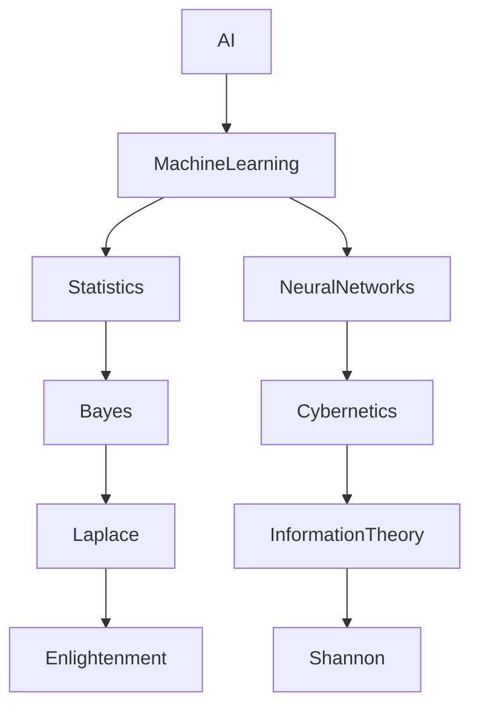
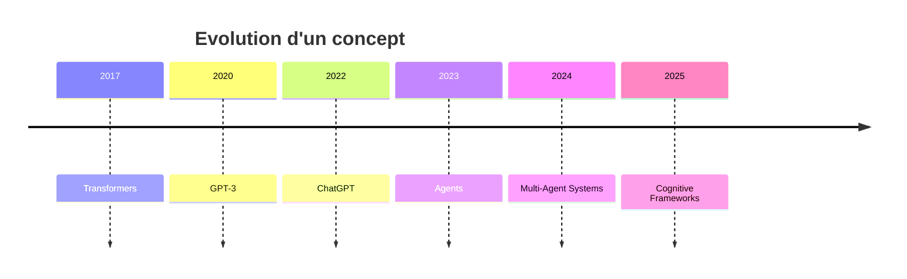

# Chapitre 5 — L'Archéologie Cognitive : fouiller les idées plutôt que les documents

> *« Une réponse est rarement intéressante. Ce qui l'est, c'est le chemin qui y conduit. »*

---

# Le changement de perspective

Depuis près de cinquante ans, l'informatique documentaire repose sur une idée simple :

> retrouver une information.

Google recherche des pages.

Un moteur RAG recherche des passages.

Une base vectorielle recherche des embeddings.

Mais Searchlores pose une question beaucoup plus ambitieuse :

> **Et si nous cherchions non pas des documents... mais la généalogie d'une idée ?**

Cette différence est immense.

---

# Pourquoi parler d'archéologie ?

À première vue, le terme paraît étrange.

Pourquoi ne pas avoir choisi :

* Analyse
* Inspection
* Audit
* Investigation

Pourquoi "Archaeology" ?

Parce que l'archéologue ne cherche pas seulement des objets.

Il cherche :

* des couches,
* des traces,
* des transformations,
* des ruptures,
* des continuités.

Autrement dit,

il cherche **l'histoire cachée derrière ce qu'il observe.**

---

# Une métaphore extrêmement pertinente

Imaginez une cité antique.

Au premier regard :

vous voyez quelques ruines.

Mais sous ces ruines se cachent :

```text
Ville moderne

↓

Empire Ottoman

↓

Empire Byzantin

↓

Rome

↓

Grèce

↓

Âge du Bronze
```

Chaque couche raconte une époque.

Aucune n'explique complètement la ville actuelle.

Ensemble,

elles racontent son histoire.

Searchlores applique exactement cette idée...

aux connaissances.

---

# Les idées possèdent des strates

Prenons un concept contemporain.

> Intelligence Artificielle

Un moteur de recherche classique retournera :

* Wikipédia
* articles
* vidéos
* publications

Searchlores chercherait plutôt :



On ne découvre plus seulement des informations.

On découvre leur histoire.

---

# Une idée n'apparaît jamais seule

C'est probablement la plus belle intuition du framework.

Aucune idée n'existe isolément.

Chaque idée possède :

* une origine,
* un contexte,
* des influences,
* des héritages,
* des bifurcations.

Autrement dit,

une idée est un organisme vivant.

---

# L'investigation devient historique

Dans beaucoup de frameworks IA :

```text
Question

↓

Réponse
```

Dans Searchlores :

```text
Question

↓

Origine

↓

Influences

↓

Évolution

↓

Conflits

↓

État actuel
```

On ne répond plus.

On reconstruit.

---

# Les couches archéologiques

À mesure que j'explorais le dépôt, j'ai commencé à voir apparaître un modèle implicite.

Une idée pourrait être décrite comme une succession de couches.

## Première couche

L'observation.

Quelqu'un remarque un phénomène.

---

## Deuxième couche

Une première interprétation.

Une hypothèse.

---

## Troisième couche

Des confirmations.

Des preuves.

---

## Quatrième couche

Une formalisation.

---

## Cinquième couche

Une théorie.

---

## Sixième couche

Une diffusion culturelle.

---

## Septième couche

Des réinterprétations.

---

Chaque investigation peut alors choisir la profondeur qu'elle souhaite explorer.

---

# Ce que voit Searchlores

Supposons qu'une IA lise :

> "Le prompt engineering est mort."

Un système classique analysera simplement cette phrase.

Searchlores cherchera :

* Qui affirme cela ?
* Pourquoi ?
* Quelles écoles de pensée s'y opposent ?
* Quelle évolution des LLM explique cette affirmation ?
* Depuis quand cette idée existe-t-elle ?
* Quelles sont ses racines ?

La différence est spectaculaire.

---

# Les preuves deviennent des fossiles

Cette analogie apparaît presque naturellement.

En archéologie :

un fossile est une trace.

Dans Searchlores :

une preuve joue exactement le même rôle.

Chaque Evidence représente une empreinte laissée dans l'histoire d'une idée.

---

# L'évolution des concepts

Les concepts ne sont jamais figés.

Prenons :

> Agent IA

En 2022 :

ce mot signifie une chose.

En 2024 :

il signifie autre chose.

En 2026 :

encore autre chose.

Searchlores cherche justement à représenter cette évolution.

---

# Une chronologie implicite

On peut représenter une investigation comme une ligne du temps.



Une réponse cesse alors d'être intemporelle.

Elle devient située.

---

# Pourquoi c'est important pour une IA ?

Les LLM souffrent souvent d'un défaut.

Ils mélangent :

* les faits,
* les opinions,
* les hypothèses,
* les croyances.

L'archéologie cognitive cherche justement à les séparer.

Elle demande :

> De quel niveau de connaissance parle-t-on ?

---

# Une architecture proche des historiens

Un historien ne demande jamais seulement :

> Que s'est-il passé ?

Il demande :

* Qui le raconte ?
* Pourquoi ?
* Avec quelles sources ?
* Selon quelle école historique ?
* Avec quels biais ?

Searchlores pousse une IA à adopter cette posture.

---

# Archéologie ≠ Fact Checking

C'est un point très intéressant.

Le framework ne cherche pas uniquement à vérifier.

Il cherche à comprendre.

Prenons deux affirmations contradictoires.

Un fact checker choisira la bonne.

L'archéologie cherchera :

* pourquoi elles coexistent,
* d'où elles viennent,
* quels récits elles servent.

Cette nuance est essentielle.

---

# Une architecture de la profondeur

À mesure que les investigations s'accumulent,

le Lore devient plus riche.

L'archéologie, elle,

devient plus profonde.

On peut imaginer :

```text
Investigation 1

↓

Lore enrichi

↓

Investigation 2

↓

Nouvelles couches

↓

Lore enrichi

↓

Investigation 3

↓

Archéologie plus profonde
```

Le système apprend donc non seulement des faits,

mais aussi leur histoire.

---

# Une inspiration inattendue

En parcourant cette partie du projet, j'ai pensé à plusieurs disciplines qui, sans être citées explicitement, semblent résonner avec sa philosophie :

* Michel Foucault et son **Archéologie du savoir**, où l'on cherche moins des vérités que les conditions qui rendent certains discours possibles.
* Carlo Ginzburg et la **micro-histoire**, attentive aux indices minuscules.
* L'intelligence économique, qui reconstitue des réseaux d'influence à partir de traces dispersées.
* Les graphes de connaissances, mais enrichis d'une dimension temporelle et interprétative.

Je ne prétends pas que Searchlores implémente directement ces approches. En revanche, sa manière de concevoir une investigation évoque clairement ces traditions intellectuelles : les faits n'y sont jamais séparés de leur contexte, de leur histoire et de leurs relations.

---

# Une lecture critique

C'est probablement ici que Searchlores prend le plus de risques… et devient le plus original.

Le concept d'archéologie cognitive est d'une richesse remarquable, mais il est aussi exigeant. Il suppose que l'on accepte de ralentir le processus de recherche pour privilégier la compréhension à la simple restitution. Cela va à contre-courant de nombreux frameworks actuels, optimisés pour produire une réponse le plus vite possible.

L'implémentation actuelle du dépôt n'atteint pas encore toute l'ambition décrite par cette vision. On trouve les fondations, les abstractions et plusieurs mécanismes prometteurs, mais une partie de cette « archéologie » demeure encore conceptuelle. Cela ne constitue pas une faiblesse : c'est plutôt le signe d'un projet qui assume une feuille de route intellectuelle ambitieuse avant même d'en avoir achevé toutes les briques techniques.

---

# Conclusion

Si le **Lore** est la mémoire vivante de Searchlores, alors l'**Archéologie Cognitive** en est la méthode d'exploration. Là où le Lore organise le savoir, l'archéologie cherche à en révéler les couches cachées, les filiations, les ruptures et les transformations.

À ce stade de notre voyage, une idée commence à émerger : Searchlores ne cherche pas seulement à faire raisonner une IA. Il cherche à lui apprendre à **enquêter comme un chercheur**, à **contextualiser comme un historien** et à **cartographier comme un explorateur**.

Dans le prochain chapitre, nous quitterons le terrain des concepts pour revenir au code. Nous analyserons le **moteur d'investigation** lui-même : son cycle de vie, ses objets internes, ses mécanismes d'orchestration et la manière dont il transforme une simple question en une enquête structurée. C'est là que la philosophie rencontrera enfin l'implémentation.
