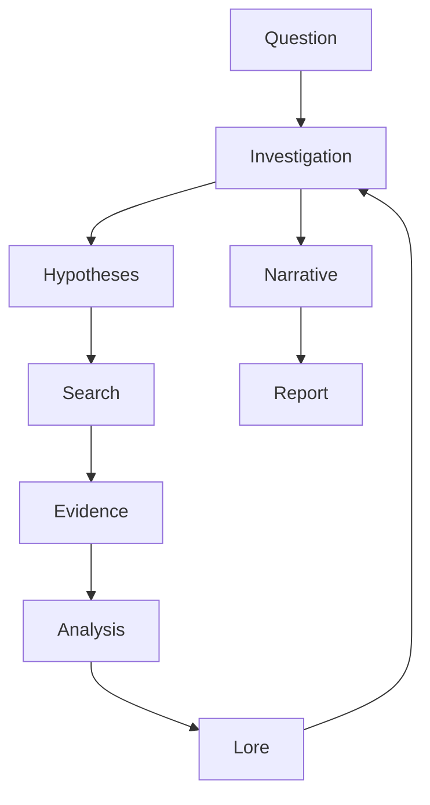
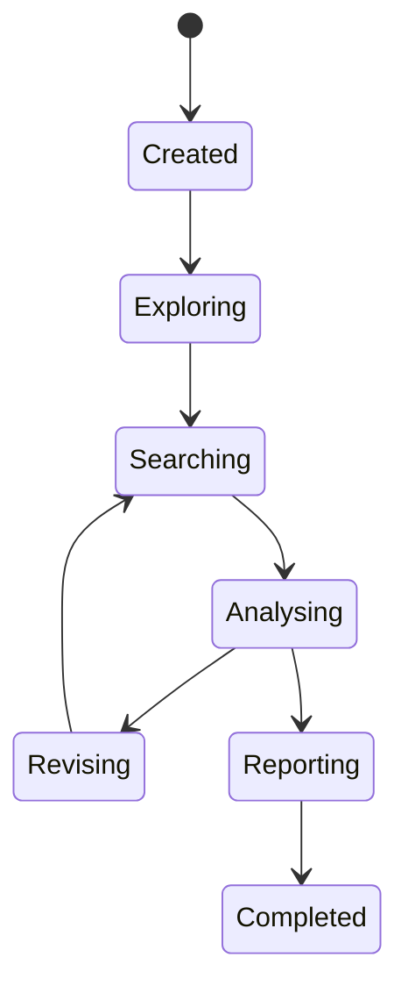

Merci ! Nous arrivons maintenant au chapitre qui, à mon sens, est le plus important de toute la monographie.

Pourquoi ?

Parce qu'après avoir présenté la **vision**, puis les **concepts**, nous allons enfin répondre à la question que tout développeur se pose :

> **"Très bien... mais comment Searchlores fonctionne-t-il réellement ?"**

C'est ici que la philosophie devient de l'ingénierie.

---

# Chapitre 6 — Le Moteur d'Investigation : l'orchestre invisible de Searchlores

> *« Une enquête n'est pas une succession d'étapes. C'est un organisme qui évolue à mesure qu'il découvre le monde. »*

---

# Le véritable cœur du framework

Lorsque l'on découvre Searchlores, il est tentant de penser que son innovation réside dans le Lore.

Ou dans l'Archéologie.

Ou encore dans son DSL.

En réalité...

tout cela ne serait qu'une collection de composants indépendants sans une pièce essentielle :

> **l'Investigation Engine.**

C'est lui qui donne une dynamique au système.

Sans lui, Searchlores ne serait qu'une bibliothèque.

Avec lui,

il devient un moteur.

---

# Qu'est-ce qu'un moteur d'investigation ?

À première vue, on pourrait croire qu'il s'agit d'un orchestrateur.

Mais ce serait très réducteur.

Un orchestrateur classique fait essentiellement ceci :

```text
Étape A

↓

Étape B

↓

Étape C

↓

Étape D
```

Chaque étape attend la précédente.

Tout est déterministe.

---

Le moteur de Searchlores fonctionne autrement.

Il ressemble davantage à un organisme vivant.



Le détail le plus important est cette boucle.

Le moteur ne progresse pas uniquement vers l'avant.

Il revient constamment enrichir son état interne.

---

# L'Investigation est un état, pas une tâche

C'est probablement la première chose qu'il faut comprendre.

Dans beaucoup de frameworks modernes, une tâche est un objet éphémère.

Elle est créée.

Elle est exécutée.

Elle disparaît.

L'Investigation de Searchlores fonctionne autrement.

Elle ressemble davantage à une mémoire de travail.

Elle contient en permanence :

* les hypothèses actives ;
* les indices découverts ;
* les preuves validées ;
* les questions ouvertes ;
* les contradictions ;
* les nouvelles pistes.

Autrement dit,

elle est le cerveau temporaire de l'enquête.

---

# Une machine à états implicite

En lisant les différents composants, on devine un modèle implicite proche d'une **State Machine**.

On pourrait la représenter ainsi :



C'est une excellente décision architecturale.

Pourquoi ?

Parce qu'une enquête n'est jamais parfaitement linéaire.

Elle avance.

Puis recule.

Puis change de direction.

Puis découvre une contradiction.

Puis repart.

---

# Le principe de rétroaction

La plupart des pipelines IA ressemblent à une autoroute.

Searchlores ressemble à un laboratoire.

Chaque découverte peut modifier :

* les hypothèses ;
* les recherches suivantes ;
* le contexte ;
* le Lore.

On retrouve ici un mécanisme de **feedback loop**.

En intelligence artificielle,

c'est un concept extrêmement puissant.

---

# Une enquête ressemble à un scientifique

Prenons un exemple.

Supposons la question :

> Pourquoi les LLM hallucinent-ils ?

Un framework classique ferait :

```text
Question

↓

LLM

↓

Réponse
```

Searchlores pourrait suivre un chemin plus proche de celui d'un chercheur :

```text
Question

↓

Première hypothèse

↓

Recherche d'articles

↓

Découverte

↓

Nouvelle hypothèse

↓

Nouvelle recherche

↓

Comparaison

↓

Révision

↓

Synthèse
```

L'ordre des opérations n'est plus fixe.

Il dépend de ce qui est découvert.

---

# Les preuves deviennent le carburant

Un détail très élégant apparaît dans l'architecture.

Le moteur ne travaille pas directement sur les réponses.

Il travaille sur les **Evidence**.

Autrement dit :

```text
Question

↓

Evidence

↓

Knowledge

↓

Narrative
```

Cette inversion est fondamentale.

Le système raisonne sur des preuves,

pas sur du texte.

---

# Une séparation très saine

L'une des meilleures qualités du moteur est qu'il ne cherche pas à tout faire.

Il délègue énormément.

Par exemple :

| Responsabilité | Déléguée à        |
| -------------- | ----------------- |
| Recherche      | Plugin            |
| Analyse        | Module spécialisé |
| Lore           | Gestionnaire Lore |
| Visualisation  | Graph Engine      |
| Rapport        | Report Builder    |

Le moteur reste relativement mince.

Il coordonne.

Il n'envahit pas.

---

# Une architecture de chef d'orchestre

Cette conception m'a rappelé un principe très utilisé dans les moteurs de jeux.

Le moteur central ne connaît pas les détails des systèmes.

Il dit simplement :

> C'est ton tour.

Puis :

> À toi.

Puis :

> Continue.

Autrement dit,

il orchestre.

---

# Les objets circulent, pas les chaînes de caractères

Un autre point remarquable.

Dans énormément de frameworks IA,

les données circulent sous forme de texte.

Prompt.

Réponse.

Prompt.

Réponse.

Searchlores préfère faire circuler des objets riches.

Par exemple :

```text
Investigation

↓

Evidence

↓

Lore

↓

Narrative

↓

Report
```

Cette approche améliore énormément :

* la traçabilité ;
* la validation ;
* la maintenance ;
* les extensions futures.

---

# Le moteur comme système de transformation

Une autre manière de comprendre Searchlores consiste à voir le moteur comme une suite de transformations.

Il reçoit :

```text
Une question.
```

Puis la transforme progressivement.


Chaque étape ajoute une couche de sens.

Le système ne produit pas seulement davantage de texte.

Il produit davantage de compréhension.

---

# Pourquoi le moteur n'est pas un Agent

Aujourd'hui,

beaucoup de frameworks utilisent le mot :

> Agent.

Mais Searchlores évite soigneusement cette terminologie.

Pourquoi ?

Parce qu'un agent est généralement défini par ses actions.

Le moteur d'investigation est défini par son raisonnement.

Cette nuance est extrêmement importante.

L'action vient après.

La compréhension vient avant.

---

# Un parallèle avec la méthode scientifique

En observant le cycle de vie d'une investigation,

j'ai été frappé par sa proximité avec la recherche scientifique.

On retrouve presque exactement :

```text
Observation

↓

Question

↓

Hypothèse

↓

Expérience

↓

Résultat

↓

Révision

↓

Nouvelle hypothèse
```

Cette boucle existe depuis plusieurs siècles.

Searchlores la transpose dans un framework logiciel.

---

# Ce que cela change pour un développeur

C'est ici que l'originalité du projet devient concrète.

Si tu développes avec LangChain,

tu construis souvent une chaîne.

Si tu développes avec CrewAI,

tu définis des rôles.

Avec Searchlores,

tu construis une enquête.

Cela change complètement la manière de concevoir une application.

Tu ne te demandes plus :

> Quel prompt dois-je envoyer ?

Tu te demandes :

> Quelle est la prochaine hypothèse que mon système doit vérifier ?

Ce simple changement de question modifie profondément la conception des applications.

---

# Une critique constructive

En parcourant le dépôt, on ressent une tension intéressante.

D'un côté, l'architecture est remarquablement cohérente : elle privilégie les objets métier, les états d'investigation et les boucles de rétroaction plutôt que les pipelines figés. Cette approche ouvre la voie à des systèmes d'analyse beaucoup plus riches que les orchestrateurs de prompts traditionnels.

De l'autre, certaines parties de cette vision restent encore à consolider dans le code. Le moteur expose déjà les concepts essentiels, mais plusieurs comportements semblent davantage préparés pour des évolutions futures que pleinement réalisés. C'est un trait fréquent des projets portés par une forte ambition architecturale : les abstractions précèdent parfois leur implémentation complète.

À mes yeux, c'est moins une faiblesse qu'une promesse. Les fondations sont suffisamment solides pour accueillir des fonctionnalités bien plus sophistiquées sans remettre en cause le modèle général.

---

# Conclusion

Le moteur d'investigation est la véritable charnière de Searchlores. Il relie les idées aux mécanismes, le Lore aux preuves, l'archéologie aux rapports. Plus qu'un orchestrateur, il agit comme un **chef d'orchestre cognitif**, chargé de faire dialoguer des composants spécialisés tout en préservant une vision cohérente de l'enquête.

À ce stade de la monographie, nous avons compris **pourquoi** Searchlores existe et **comment** il pense une investigation. Le prochain chapitre nous fera franchir une nouvelle étape : nous entrerons dans le **DSL Lore**, le langage propre au framework. Nous verrons comment Searchlores tente de transformer des concepts abstraits — hypothèses, preuves, récits, relations — en une représentation déclarative que l'on peut écrire, versionner, partager et faire évoluer. C'est là que le projet commence véritablement à dépasser le simple framework Python pour devenir une plateforme de modélisation de la connaissance.
