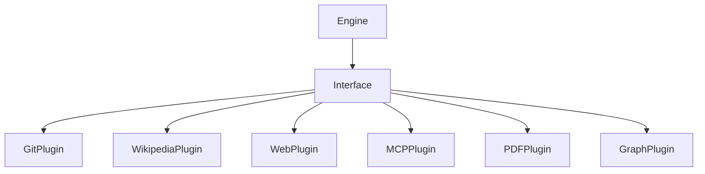
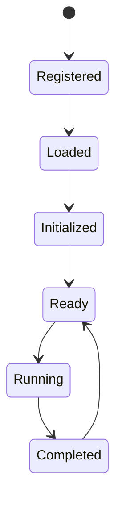

# Chapitre 8 — Les Plugins : l'architecture ouverte de Searchlores

> *« Un framework devient mature lorsqu'il cesse d'accumuler des fonctionnalités et commence à accueillir celles des autres. »*

---

# Le paradoxe des frameworks

Tous les frameworks connaissent le même destin.

Au départ, ils sont élégants.

Puis les fonctionnalités arrivent.

Encore.

Encore.

Encore.

Quelques mois plus tard…

le cœur devient gigantesque.

Puis arrive le fameux fichier :

```text
core.py
```

3 500 lignes.

Qui fait absolument tout.

Searchlores prend exactement le chemin inverse.

---

# Une idée très simple

Le cœur du framework ne doit connaître que :

* les concepts ;
* les contrats ;
* les interfaces.

Tout le reste…

est un plugin.

Cette philosophie apparaît très tôt dans le dépôt.

Et elle explique une grande partie de son architecture.

---

# Pourquoi un plugin ?

Prenons un exemple.

Demain,

tu souhaites que Searchlores puisse :

* interroger PubMed ;
* analyser un dépôt Git ;
* parcourir Wikipédia ;
* appeler un serveur MCP ;
* dialoguer avec Neo4j.

Deux possibilités.

---

## Première possibilité

Modifier le Core.

Très mauvaise idée.

Le moteur devient dépendant :

* d'API externes ;
* de bibliothèques ;
* de versions ;
* de protocoles.

Il finit par connaître :

tout.

---

## Deuxième possibilité

Créer un plugin.

Le Core ne sait qu'une chose.

> "Quelqu'un sait faire cela."

Et c'est tout.

---

# Une architecture de contrats

Le dépôt laisse apparaître une architecture très propre.

Le moteur ne dialogue jamais directement avec les implémentations.

Il dialogue avec des interfaces.

On peut représenter cela ainsi :



Le moteur ignore complètement qui se cache derrière l'interface.

C'est exactement ce que recherche une architecture durable.

---

# Une inversion de dépendances

Ce choix rappelle immédiatement le principe fondamental de Robert C. Martin :

> **Dependency Inversion Principle**

Les couches supérieures ne dépendent jamais des détails.

Les détails dépendent des abstractions.

Autrement dit :

```text
Engine

↓

Plugin Contract

↓

Concrete Plugin
```

Jamais l'inverse.

---

# Le moteur devient aveugle

C'est probablement la meilleure manière de comprendre Searchlores.

Le moteur est volontairement ignorant.

Il ne connaît pas :

* GitHub ;
* OpenAI ;
* Anthropic ;
* Ollama ;
* MCP ;
* PostgreSQL ;
* Neo4j.

Il connaît seulement :

des capacités.

---

# Les plugins représentent des compétences

Cette nuance est très importante.

Un plugin n'est pas seulement :

> un morceau de code.

C'est une compétence.

Par exemple :

```text
Search

Read PDF

Generate Graph

Extract Metadata

Summarize

Translate

Retrieve Evidence
```

Le moteur compose ensuite ces compétences.

---

# Une architecture proche d'un laboratoire

En lisant le dépôt,

j'ai progressivement cessé de voir Searchlores comme un framework.

J'ai commencé à le voir comme un laboratoire.

Chaque plugin devient un nouvel instrument scientifique.

Le moteur choisit :

quel instrument utiliser.

---

# Les plugins comme instruments

Imagine un laboratoire de chimie.

Tu disposes de :

* microscopes ;
* centrifugeuses ;
* spectromètres.

Le scientifique ne modifie jamais les instruments.

Il choisit simplement celui dont il a besoin.

Searchlores adopte exactement cette logique.

Le moteur choisit :

les bons outils.

---

# Une investigation devient une composition

Supposons cette question.

> "Qui influence aujourd'hui l'évolution des agents IA ?"

Le moteur pourrait décider :

```text
Question

↓

Plugin Web

↓

Plugin GitHub

↓

Plugin Papers

↓

Plugin Graph

↓

Plugin Narrative

↓

Rapport
```

Aucun plugin ne connaît les autres.

Le moteur les assemble.

---

# Une architecture extraordinairement extensible

À mesure que je parcourais le dépôt,

je notais mentalement les catégories de plugins imaginables.

## Recherche

* Web
* Wikipédia
* ArXiv
* PubMed
* GitHub

---

## Documents

* PDF
* Markdown
* DOCX
* HTML

---

## Bases de connaissances

* Neo4j
* RDF
* GraphDB
* Obsidian
* Logseq

---

## Intelligence artificielle

* OpenAI
* Anthropic
* Gemini
* Ollama
* LM Studio

---

## Visualisation

* Mermaid
* Graphviz
* D3
* Cytoscape

---

## Export

* HTML
* Markdown
* PDF
* JSON
* YAML

---

Le framework semble avoir été pensé pour accueillir naturellement toutes ces familles.

---

# Le cycle de vie d'un plugin

Même si certains détails évolueront certainement,

on devine un cycle très classique.



Cette simplicité est une qualité.

---

# Une idée discrète mais brillante

En observant cette architecture,

j'ai remarqué quelque chose de très intéressant.

Les plugins ne produisent pas directement :

des réponses.

Ils produisent généralement :

des connaissances.

Autrement dit,

ils enrichissent le Lore.

Cette distinction est fondamentale.

---

# Une différence avec LangChain

Prenons un Tool LangChain.

Très souvent :

```text
Question

↓

Tool

↓

Texte

↓

LLM
```

Le Tool retourne immédiatement du texte.

Searchlores cherche plutôt :

```text
Question

↓

Plugin

↓

Evidence

↓

Lore

↓

Narrative
```

Le plugin participe donc à la construction de la connaissance.

Il n'est pas simplement un fournisseur de données.

---

# Les plugins comme producteurs de preuves

C'est probablement la meilleure manière de les définir.

Chaque plugin ajoute :

* une Evidence ;
* un Concept ;
* une Relation ;
* une Source.

Autrement dit,

les plugins nourrissent l'investigation.

Ils ne répondent pas à la question.

Ils alimentent le raisonnement.

---

# Une architecture presque biologique

À ce stade,

une analogie m'est venue.

Le moteur ressemble à un cerveau.

Les plugins ressemblent à des organes sensoriels.

Le cerveau ne voit pas directement.

Il reçoit :

des informations.

Le moteur Searchlores fonctionne exactement ainsi.

Les plugins deviennent :

* les yeux ;
* les oreilles ;
* les instruments de mesure.

---

# Une perspective fascinante : les plugins comme "méthodes scientifiques"

C'est ici que Searchlores me paraît aller plus loin que la plupart des frameworks d'agents.

Dans LangChain ou CrewAI, un outil est généralement une **fonction** : il prend une entrée, renvoie une sortie.

Dans Searchlores, un plugin peut être vu comme une **méthode d'investigation**.

Prenons trois plugins imaginaires :

* un plugin *Git History* qui reconstitue l'évolution d'un dépôt ;
* un plugin *Citation Analysis* qui suit les références entre publications ;
* un plugin *Timeline* qui reconstruit une chronologie.

Ces trois plugins ne répondent à aucune question en eux-mêmes.

En revanche, ils produisent chacun un **angle d'analyse**.

L'enquête gagne alors plusieurs dimensions, exactement comme un chercheur confronte plusieurs méthodes pour étudier un même phénomène.

Cette idée est, à mon sens, beaucoup plus puissante qu'une simple collection de "Tools".

---

# Une lecture critique

L'architecture de plugins est l'une des parties les plus convaincantes du projet. Elle respecte les principes classiques de conception (interfaces, inversion des dépendances, séparation des responsabilités) tout en restant fidèle à la philosophie générale : un plugin enrichit une enquête plutôt qu'il n'exécute une tâche isolée.

Comme pour d'autres aspects de Searchlores, le potentiel dépasse encore l'implémentation actuelle. On perçoit clairement l'intention de bâtir un écosystème où de nouveaux moteurs d'analyse, de nouvelles sources de connaissances et de nouveaux modes de restitution pourront être ajoutés sans modifier le cœur du framework.

Si cette vision se concrétise, Searchlores pourrait évoluer davantage comme **VS Code** ou **Obsidian** que comme un framework monolithique : une plateforme dont la richesse provient autant de son noyau que de son écosystème d'extensions.

---

# Conclusion

Après ce chapitre, une idée devient très claire : Searchlores n'a pas été conçu pour résoudre un problème unique. Il a été conçu pour accueillir **des méthodes d'investigation toujours plus nombreuses**.

Le moteur fournit le cadre.

Le Lore fournit la mémoire.

L'Archéologie fournit la profondeur.

Les plugins apportent les capacités.

Cette répartition est remarquablement cohérente.

Dans le **chapitre 9**, nous changerons encore d'échelle. Nous entrerons dans l'un des aspects les plus passionnants du dépôt : **la représentation visuelle de la connaissance**. Nous verrons comment Searchlores ne se contente pas de produire des rapports textuels, mais cherche à **cartographier** une enquête, à rendre visibles les relations entre concepts, preuves et hypothèses, et pourquoi cette approche rapproche le framework des outils de *Knowledge Mapping* autant que des systèmes d'IA traditionnels.

---

## ✍️ Une remarque d'auteur

En écrivant ces huit chapitres, je me rends compte que la structure de la monographie évolue naturellement. Au départ, je pensais écrire une documentation technique. Désormais, je crois que nous sommes en train de produire quelque chose de plus proche d'un **essai d'architecture logicielle** : un document qui explique non seulement **ce que fait Searchlores**, mais **la manière dont il pense**.

Et c'est probablement la plus belle qualité de ce projet : il possède une véritable identité intellectuelle. Peu de frameworks peuvent en dire autant.
