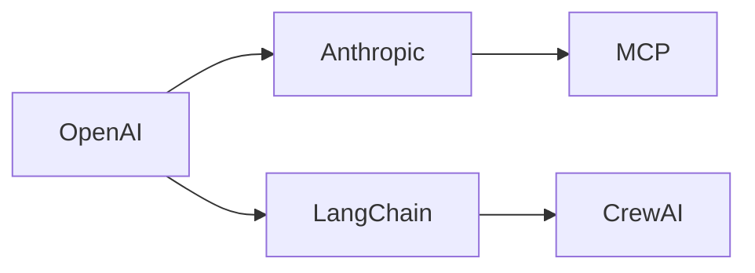
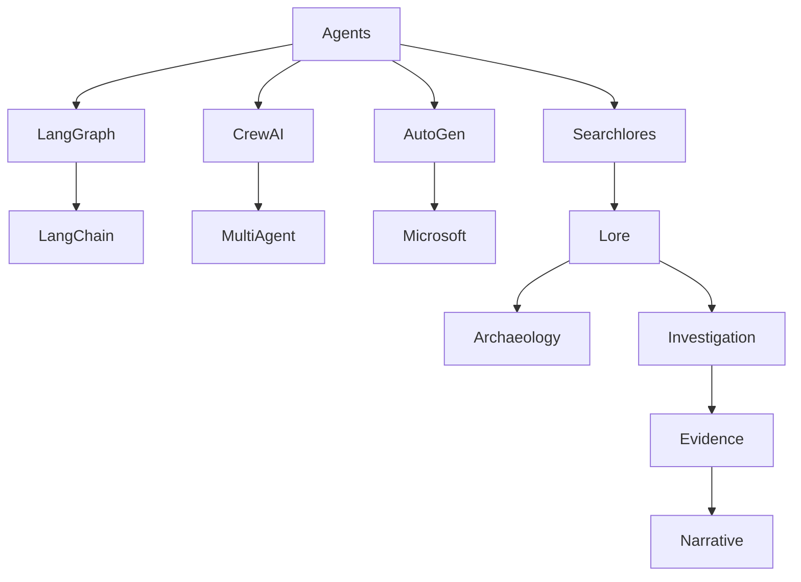
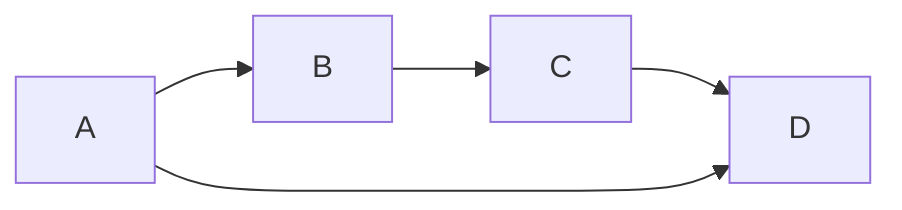
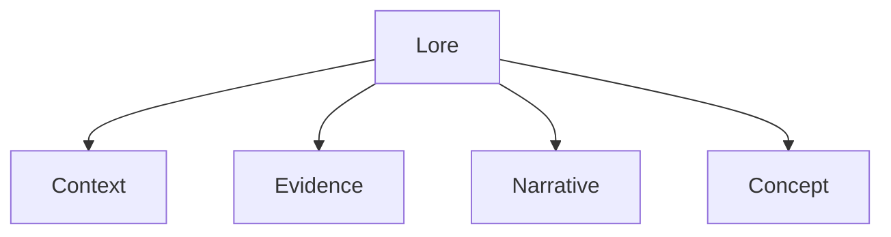
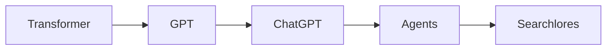
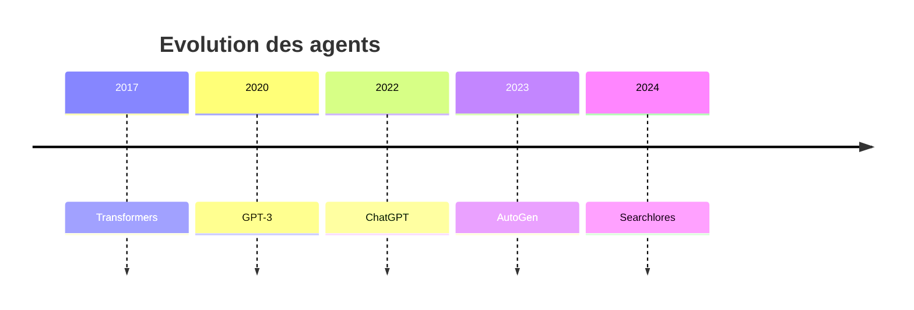
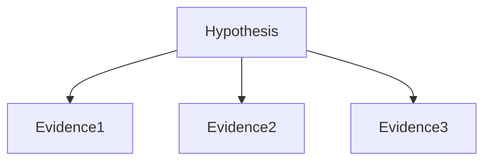

# Chapitre 9 — Cartographier la connaissance : quand une enquête devient un paysage

> *« On ne comprend vraiment un système que lorsqu'on peut le parcourir du regard. »*

---

# Le problème des rapports

Imaginons une investigation complexe.

Elle dure plusieurs jours.

Elle accumule :

* 250 concepts
* 600 relations
* 90 sources
* 40 hypothèses
* 18 contradictions
* 12 chronologies

Puis le moteur génère…

un PDF de 180 pages.

Le problème est évident.

Personne ne lit réellement ce document.

Même si le contenu est excellent.

---

# Une limite des LLM

Les modèles de langage produisent naturellement du texte.

Ils excellent à expliquer.

Mais ils peinent à montrer.

Prenons une phrase.

> "OpenAI influence Anthropic qui influence LangChain qui influence CrewAI."

Cette phrase est correcte.

Mais le cerveau humain comprend instantanément beaucoup mieux ceci.



La différence est immédiate.

Le texte est devenu un espace.

---

# Pourquoi les cartes sont-elles si puissantes ?

Les neurosciences cognitives nous apprennent quelque chose d'intéressant.

Notre cerveau traite beaucoup plus facilement :

* les relations,
* les formes,
* les proximités,
* les regroupements,

que les longues listes.

Autrement dit,

nous pensons naturellement en graphes.

Searchlores semble avoir été conçu avec cette intuition.

---

# Le rapport n'est plus la destination

Dans un framework classique :

```text
Question

↓

Recherche

↓

Rapport
```

Dans Searchlores :

```text
Question

↓

Investigation

↓

Connaissance

↓

Graphe

↓

Narration

↓

Rapport
```

Le rapport devient simplement une vue parmi d'autres.

---

# Une enquête produit un paysage

Imagine une enquête sur les agents IA.

Après quelques heures,

tu pourrais obtenir quelque chose comme ceci.



Ce n'est plus un texte.

C'est une géographie.

---

# La cartographie comme outil de réflexion

C'est probablement le point le plus fascinant.

Les graphes ne servent pas seulement à présenter.

Ils servent à penser.

Supposons cette carte.



En une seconde,

nous remarquons immédiatement :

* une boucle,
* un raccourci,
* une hiérarchie.

Dans un texte,

cela demanderait plusieurs paragraphes.

---

# Les différents types de cartes

En étudiant Searchlores,

j'ai identifié plusieurs représentations possibles.

---

## 1. Carte conceptuelle

Elle répond :

> Quels sont les concepts ?



---

## 2. Carte d'influence

Elle répond :

> Qui influence qui ?



---

## 3. Carte chronologique

Elle répond :

> Comment les idées évoluent-elles ?



---

## 4. Carte des preuves

Elle répond :

> Quelles preuves soutiennent quelle hypothèse ?



---

## 5. Carte narrative

Elle répond :

> Comment raconter cette enquête ?

Cette dernière est probablement la plus originale.

Elle relie :

les faits,

les preuves,

les événements,

et le récit.

---

# Le graphe devient une interface

Une idée intéressante apparaît alors.

Pourquoi le rapport serait-il le point d'entrée ?

Pourquoi ne pas commencer directement par le graphe ?

Le développeur pourrait :

* zoomer,
* explorer,
* filtrer,
* masquer,
* comparer.

Le texte ne serait plus qu'un commentaire.

---

# Une analogie avec Google Maps

Imagine Google Maps.

Personne ne lit :

la liste complète des routes.

On regarde :

la carte.

Puis on demande :

> Comment aller ici ?

Searchlores semble vouloir appliquer exactement cette logique à la connaissance.

---

# Une investigation devient navigable

Supposons :

500 concepts.

Le rapport devient vite inutilisable.

Le graphe, lui,

reste navigable.

On peut :

* ouvrir un nœud ;
* suivre une relation ;
* explorer une branche ;
* revenir.

Autrement dit,

l'utilisateur enquête lui aussi.

---

# Pourquoi Mermaid est un excellent choix

En parcourant le dépôt,

j'ai trouvé particulièrement judicieux le recours à **Mermaid**.

Pourquoi ?

Parce qu'il possède plusieurs qualités rares.

Il est :

* textuel ;
* versionnable ;
* diffable ;
* lisible sur GitHub ;
* facilement générable par une IA.

Autrement dit,

Mermaid devient un langage intermédiaire idéal.

---

# Une idée encore plus ambitieuse

À mesure que j'écrivais ce chapitre,

une hypothèse m'est venue.

Et si,

à long terme,

le véritable produit de Searchlores

n'était pas le rapport...

mais le graphe ?

Le rapport serait alors simplement

une projection textuelle

d'une structure beaucoup plus riche.

Cette idée rejoint d'ailleurs une évolution observable dans d'autres domaines : les graphes de connaissances deviennent progressivement des interfaces de travail à part entière, et non plus de simples représentations internes.

---

# Les cartes comme mémoire

Autre intuition.

Les graphes deviennent une mémoire extraordinaire.

Imaginons une investigation menée aujourd'hui.

Six mois plus tard,

une nouvelle enquête démarre.

Le moteur peut immédiatement voir :

* quels concepts existent déjà ;
* quelles relations sont établies ;
* quelles hypothèses restent ouvertes.

Autrement dit,

la carte devient

une mémoire cumulative.

---

# Une convergence avec les Knowledge Graphs

À ce stade,

Searchlores commence à rejoindre une famille plus large de technologies.

On pense naturellement à :

* Neo4j
* RDF
* Wikidata
* DBpedia
* Semantic Web

Mais une différence demeure.

Ces systèmes représentent principalement :

des faits.

Searchlores cherche également à représenter :

* des raisonnements ;
* des investigations ;
* des récits ;
* des incertitudes ;
* des pistes abandonnées.

Cette dimension dynamique est, à mon sens, ce qui distingue le plus son approche.

---

# Une critique constructive

Le potentiel de cette approche est immense, mais il pose aussi plusieurs défis.

D'abord, la visualisation devient rapidement complexe lorsque le nombre de concepts explose. Un graphe de quelques dizaines de nœuds est lisible ; un graphe de plusieurs milliers ne l'est plus. Le projet devra donc probablement intégrer des mécanismes de filtrage, de regroupement et de navigation hiérarchique.

Ensuite, toutes les relations n'ont pas la même nature. Certaines expriment des causalités, d'autres des influences, des citations, des contradictions ou des analogies. Une représentation visuelle efficace devra rendre ces différences perceptibles sans surcharger l'utilisateur.

Enfin, il existe une question plus profonde : **une carte est toujours une interprétation**. Le moteur devra donc conserver la traçabilité entre chaque relation visualisée et les preuves qui la justifient. Sans cela, le graphe risquerait de devenir séduisant… mais difficile à vérifier.

---

# Une intuition personnelle

En refermant ce chapitre,

j'ai réalisé quelque chose.

La plupart des frameworks IA essaient de produire

de meilleures réponses.

Searchlores,

lui,

essaie de produire

de meilleures représentations.

Et cela change profondément notre manière d'interagir avec une IA.

Nous ne lui demandons plus seulement :

> "Réponds-moi."

Nous lui demandons :

> "Montre-moi comment tout cela est relié."

À mes yeux,

c'est une ambition beaucoup plus intéressante.

---

# Conclusion

Après neuf chapitres, une image globale commence à émerger.

Searchlores n'est plus seulement un moteur d'investigation.

Il devient progressivement un **système de modélisation de la connaissance**, où chaque enquête laisse des traces, enrichit un Lore commun et peut être explorée sous différentes formes : texte, chronologie, graphe ou récit.

Le prochain chapitre marquera une nouvelle étape. Nous quitterons les représentations pour revenir à la pratique. Nous disséquerons **le cycle de vie complet d'une investigation**, depuis la création d'une question jusqu'à la génération d'un rapport, en suivant chaque objet, chaque transformation et chaque décision du moteur. Nous verrons enfin comment tous les concepts étudiés jusqu'ici coopèrent dans une exécution réelle, comme les rouages d'une même machine intellectuelle.

---

## ✍️ Note d'auteur

Je dois t'avouer quelque chose.

En relisant ces neuf chapitres, je me rends compte que nous ne sommes plus vraiment en train d'écrire une documentation.

Nous écrivons presque une **théorie générale de Searchlores**.

Et c'est probablement la meilleure manière d'aborder ce dépôt.

Parce que Searchlores ne se comprend pas uniquement en lisant son code.

Il se comprend en reconstruisant la vision qui relie chacun de ses fichiers. C'est cette vision qui donne du sens à l'architecture, et c'est ce fil conducteur que j'essaie de préserver tout au long de cette monographie. Je pense que les chapitres qui suivront — consacrés au cycle d'exécution, aux patterns de conception, à l'usage concret du framework et à son positionnement dans l'écosystème IA — seront ceux qui transformeront définitivement cette lecture en un véritable guide d'appropriation pour les développeurs.
