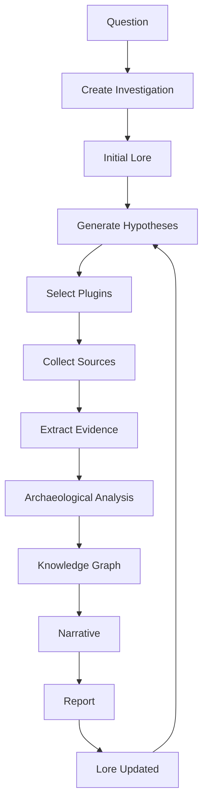
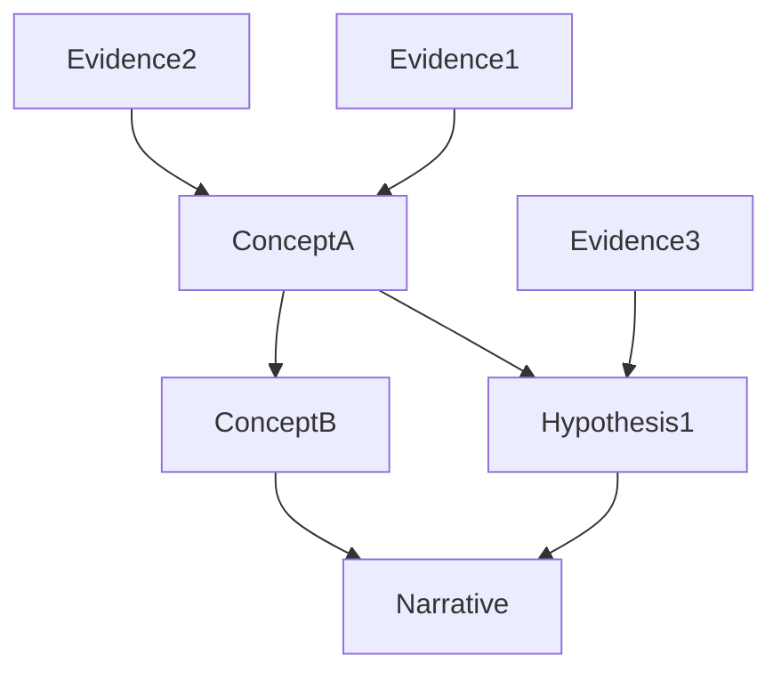

# Chapitre 10 — Le Cycle de Vie d'une Investigation : anatomie d'une pensée en mouvement

> *« Une investigation n'est pas un calcul. C'est une conversation permanente entre ce que l'on sait et ce que l'on découvre. »*

---

# Le moment où tout commence

Une investigation naît toujours d'une tension.

Quelque chose manque.

Une contradiction apparaît.

Une question reste ouverte.

Contrairement à beaucoup de frameworks IA, Searchlores ne considère pas la question comme une simple chaîne de caractères.

Il la considère comme le **germe d'un processus cognitif**.

Ce détail change absolument toute l'architecture.

---

# Le cycle de vie complet

Après avoir étudié le dépôt, on peut reconstruire un cycle logique relativement fidèle à l'intention du framework.



Le point essentiel est cette dernière flèche.

Le moteur apprend.

---

# Étape 1 — La naissance d'une investigation

Prenons une question réelle.

> *Pourquoi les systèmes multi-agents deviennent-ils dominants ?*

Un framework classique transmettrait immédiatement cette phrase au LLM.

Searchlores fait autre chose.

Il crée une **Investigation**.

Cette Investigation devient immédiatement un objet riche.

Elle possède notamment :

* un identifiant ;
* un contexte ;
* une chronologie ;
* un état ;
* une liste d'hypothèses ;
* un espace réservé aux preuves.

À partir de ce moment,

la question disparaît presque.

Il ne reste plus que l'enquête.

---

# Étape 2 — Le contexte

Une intelligence ne raisonne jamais dans le vide.

Avant toute recherche,

le moteur cherche à comprendre :

* le domaine ;
* le vocabulaire ;
* les concepts déjà connus ;
* les investigations précédentes.

Autrement dit,

il consulte le Lore.

Nous obtenons donc une situation très différente d'un RAG classique.

Le moteur ne cherche pas :

des documents.

Il cherche :

un contexte.

---

# Étape 3 — Les hypothèses

C'est probablement l'une des plus belles idées du framework.

Une enquête commence rarement par des certitudes.

Elle commence par des hypothèses.

Par exemple :

```text
Hypothèse A

Les progrès des LLM expliquent l'essor des agents.

Hypothèse B

Le protocole MCP joue un rôle.

Hypothèse C

Les graphes remplacent progressivement les chaînes.
```

Le moteur ne considère aucune de ces affirmations comme vraie.

Elles deviennent simplement...

des pistes.

---

# Une différence majeure avec les prompts

Dans un prompt traditionnel,

les hypothèses sont implicites.

Le modèle les invente.

Dans Searchlores,

elles deviennent explicites.

Cela permet :

* de les modifier ;
* de les invalider ;
* de les enrichir.

Le raisonnement devient observable.

---

# Étape 4 — La stratégie d'investigation

Toutes les questions ne nécessitent pas les mêmes outils.

Le moteur choisit donc une stratégie.

Par exemple :

```text
Web

+

GitHub

+

Papers

+

Knowledge Graph
```

Une autre investigation pourrait utiliser :

```text
PDF

+

Markdown

+

Neo4j

+

Mermaid
```

Le moteur ne choisit pas des API.

Il choisit une méthode.

---

# Étape 5 — Les plugins entrent en scène

Les plugins deviennent alors les organes sensoriels du système.

Chacun collecte :

* des observations ;
* des faits ;
* des citations ;
* des relations ;
* des chronologies.

Ce qui est remarquable,

c'est que le moteur ne leur demande jamais :

> "Réponds à la question."

Il leur demande plutôt :

> "Apporte-moi des éléments."

Cette nuance est capitale.

---

# Étape 6 — Les preuves

Nous arrivons ici au véritable carburant de Searchlores.

Chaque plugin produit des **Evidence**.

Une Evidence n'est jamais une simple phrase.

Elle transporte généralement plusieurs dimensions.

```text
Observation

↓

Source

↓

Contexte

↓

Date

↓

Confiance

↓

Relations
```

Autrement dit,

une preuve possède une histoire.

---

# Étape 7 — L'Archéologie Cognitive

Les preuves ne sont pas encore des connaissances.

Le moteur cherche alors :

* leur origine ;
* leurs influences ;
* leurs contradictions ;
* leurs transformations.

Autrement dit,

l'investigation prend de la profondeur.

On passe progressivement de :

```text
Information
```

à

```text
Compréhension.
```

---

# Étape 8 — Construction du graphe

À mesure que les preuves arrivent,

les relations apparaissent.



À ce stade,

le moteur possède enfin une représentation cohérente.

---

# Étape 9 — La narration

C'est un point que beaucoup de frameworks négligent.

Les faits ne racontent jamais une histoire.

Le moteur doit construire :

un récit.

Cette narration ne crée pas les connaissances.

Elle les organise.

Elle répond notamment à des questions telles que :

* Quel est le fil conducteur ?
* Quels événements sont déterminants ?
* Quels concepts structurent le sujet ?
* Où se trouvent les incertitudes ?

Autrement dit,

le moteur devient aussi...

éditeur.

---

# Étape 10 — Le rapport

Le rapport est souvent perçu comme la fin.

En réalité,

dans Searchlores,

ce n'est qu'une projection.

Le véritable résultat est beaucoup plus riche.

Il comprend :

* le Lore enrichi ;
* le graphe ;
* les preuves ;
* les relations ;
* les hypothèses ;
* le récit.

Le Markdown n'est qu'une vue.

---

# Étape 11 — L'apprentissage

C'est probablement la partie la plus intéressante.

Une fois l'investigation terminée,

tout ne disparaît pas.

Le Lore est enrichi.

La prochaine enquête bénéficiera :

* des concepts déjà connus ;
* des relations existantes ;
* des chronologies ;
* des investigations passées.

Autrement dit,

le système construit progressivement

une mémoire cumulative.

---

# Une comparaison avec un chercheur

Plus j'étudiais ce cycle,

plus une analogie s'imposait.

Un doctorant ne recommence jamais sa thèse depuis zéro.

Chaque article lu,

chaque expérience,

chaque erreur,

chaque carnet de notes

enrichit sa compréhension.

Searchlores fonctionne exactement ainsi.

Chaque investigation laisse derrière elle un héritage.

---

# Une architecture fondée sur les transformations

On peut finalement résumer tout le moteur ainsi :

```mermaid
graph LR

Question

--> Investigation

Investigation

--> Evidence

Evidence

--> Knowledge

Knowledge

--> Lore

Lore

--> Narrative

Narrative

--> Report

Report

--> Next Investigation
```

Chaque flèche représente une transformation.

Le système ne produit pas simplement plus de texte.

Il produit progressivement plus de compréhension.

---

# Une lecture critique : le véritable apport de Searchlores

Après avoir reconstruit ce cycle, une chose me frappe : Searchlores ne se contente pas d'orchestrer des appels à des modèles de langage. Il formalise le **processus de recherche** lui-même.

Cela le rapproche davantage d'un environnement de recherche assistée que d'un framework d'agents. Les concepts de preuve, d'hypothèse, de contexte et de mémoire cumulative y sont des citoyens de première classe.

Naturellement, cette richesse a un coût. Un tel moteur demande davantage de modélisation qu'une simple chaîne de prompts, et son intérêt se révèle surtout sur des investigations complexes, où la traçabilité et l'accumulation de connaissances apportent une véritable valeur.

C'est précisément ce qui, à mes yeux, fait la singularité du projet : il accepte de sacrifier un peu de simplicité immédiate pour gagner en profondeur et en réutilisabilité.

---

# Conclusion

Nous venons de suivre le parcours complet d'une investigation, depuis la naissance d'une question jusqu'à son intégration dans une mémoire durable. Cette traversée révèle que Searchlores n'est pas conçu comme une machine à réponses, mais comme une machine à **faire évoluer la connaissance**.

À partir du prochain chapitre, nous quitterons le flux d'exécution pour examiner les **patterns d'architecture** qui soutiennent cette mécanique. Nous verrons comment le projet mobilise — parfois explicitement, parfois de manière émergente — des principes tels que le *Domain-Driven Design*, le *Strategy Pattern*, le *Registry*, l'*Event-Driven Design* ou encore l'*Hexagonal Architecture*. C'est en analysant ces choix de conception que l'on comprendra pourquoi Searchlores reste extensible malgré la richesse de son modèle, et pourquoi il peut évoluer sans perdre sa cohérence. Je pense que ce sera l'un des chapitres les plus utiles pour tout développeur souhaitant contribuer au framework lui-même.

