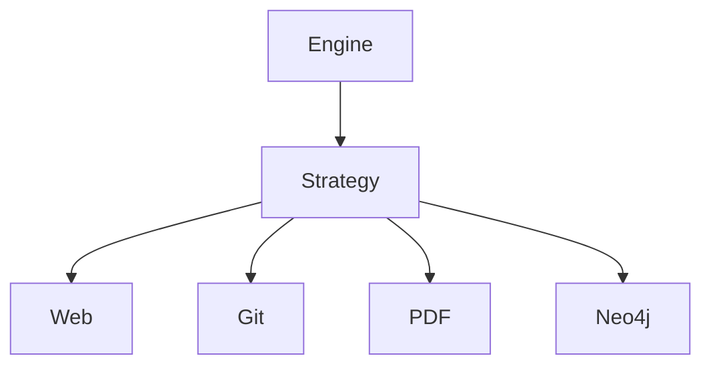
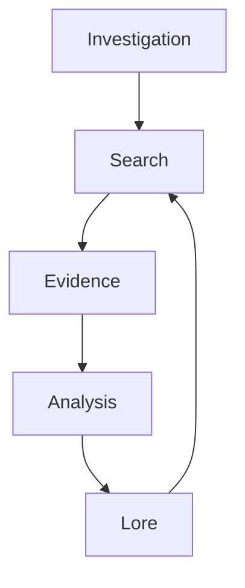
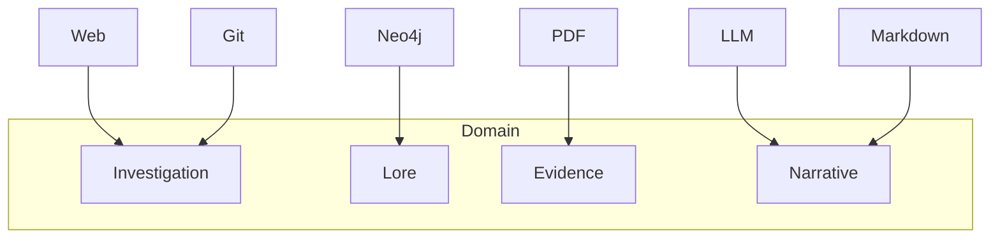

# Chapitre 11 — Les Patterns Architecturaux : lorsque le domaine façonne l'architecture

> *« Les meilleurs patterns sont ceux que l'on découvre après avoir écrit le logiciel, pas ceux que l'on décide d'utiliser avant. »*

---

# Une architecture qui ne ressemble pas à un framework IA

Lorsque l'on ouvre Searchlores pour la première fois, une impression étrange apparaît.

On ne retrouve pas immédiatement les éléments devenus classiques des frameworks IA modernes :

* chaînes (*Chains*)
* agents omnipotents
* outils (*Tools*)
* pipelines de prompts

À la place, on découvre :

* Investigations
* Lore
* Evidence
* Narratives
* Archaeology

Autrement dit,

on découvre un **langage métier**.

Et cela change tout.

---

# Le premier pattern : Domain-Driven Design

Même si le projet ne revendique pas explicitement une approche **DDD**, il en reprend de nombreux principes.

Le domaine dirige le code.

Jamais l'inverse.

Les objets principaux ne sont pas techniques.

Ils sont métier.

```text
Investigation

Lore

Evidence

Narrative

Concept

Hypothesis
```

Aucun de ces mots n'est lié à Python.

Tous décrivent le problème à résoudre.

---

# Le langage ubiquitaire

Eric Evans parle d'un **Ubiquitous Language**.

C'est exactement ce qui apparaît ici.

Lorsque deux développeurs discutent de Searchlores, ils ne disent pas :

> "Passe-moi ce dictionnaire Python."

Ils disent :

> "Cette Evidence invalide cette Hypothesis."

Ou encore :

> "Cette Investigation enrichit le Lore."

Le vocabulaire du code devient celui de la réflexion.

Et inversement.

---

# Les objets sont riches

Dans beaucoup de frameworks IA,

les objets servent essentiellement de conteneurs.

```python
Prompt

↓

String

↓

Response

↓

String
```

Searchlores fait exactement le contraire.

Chaque objet possède :

* une identité ;
* un cycle de vie ;
* une responsabilité ;
* une histoire.

Autrement dit,

ce sont de véritables objets métier.

---

# Le Strategy Pattern

Prenons maintenant le moteur.

Une investigation peut utiliser :

* un moteur Web ;
* un moteur Git ;
* un moteur PDF ;
* un moteur Graph.

Le moteur n'a pas besoin de savoir lequel sera utilisé.

Il délègue.

Nous retrouvons naturellement le **Strategy Pattern**.



Le comportement devient interchangeable.

---

# Le Registry Pattern

Un autre pattern apparaît discrètement.

Le framework possède de nombreux composants qui doivent être découverts dynamiquement :

* plugins
* analyseurs
* visualisations
* exports
* moteurs

Plutôt que de coder toutes les dépendances,

le projet semble s'orienter vers un **Registry**.

```text
Plugin Registry

↓

Lookup

↓

Instantiation

↓

Execution
```

Cette approche facilite énormément les extensions.

---

# Le Factory Pattern

À plusieurs endroits,

on devine également des mécanismes de création centralisée.

Une Investigation ne devrait jamais être construite manuellement.

Elle devrait être créée par un composant dédié.

```text
Question

↓

Factory

↓

Investigation
```

Cela garantit :

* la cohérence ;
* la validation ;
* l'initialisation correcte.

---

# Le Pipeline Pattern... mais revisité

À première vue,

Searchlores ressemble à un pipeline.

Mais seulement à première vue.

Un pipeline classique est linéaire.

```text
A

↓

B

↓

C

↓

D
```

Searchlores fonctionne davantage comme ceci.



Le pipeline devient cyclique.

Il possède des rétroactions.

---

# Event-Driven Design

Une autre lecture possible consiste à voir le moteur comme une succession d'événements.

Par exemple :

```text
InvestigationCreated

↓

EvidenceAdded

↓

HypothesisUpdated

↓

LoreExtended

↓

NarrativeCompleted
```

Même si le dépôt n'implémente pas forcément un véritable *Event Bus*, cette manière de penser est déjà présente dans les responsabilités des objets.

Elle ouvrirait naturellement la voie à une architecture encore plus modulaire.

---

# Une Hexagonal Architecture implicite

Plus je relisais le dépôt,

plus une architecture hexagonale apparaissait.

Au centre :

```text
Lore

Investigation

Evidence
```

Autour :

```text
Web

GitHub

PDF

Neo4j

LLM

Markdown

Graph
```

Les dépendances pointent toujours vers le domaine.

Jamais l'inverse.

---

On pourrait représenter cela ainsi.



Le domaine reste indépendant.

---

# CQRS... sans le dire

Une autre idée intéressante apparaît.

Les objets ne servent pas tous aux mêmes usages.

Certains servent principalement à :

lire.

D'autres à :

modifier.

Autrement dit,

on retrouve une séparation proche du **CQRS**.

Même si elle reste discrète.

---

# L'immutabilité des preuves

Les **Evidence** m'ont rappelé un autre principe.

Une preuve ne devrait jamais être modifiée.

Elle devrait être :

* créée ;
* référencée ;
* éventuellement invalidée.

Mais jamais réécrite.

Cette idée rapproche Searchlores de certains modèles orientés événements.

---

# Event Sourcing : une évolution naturelle ?

En poursuivant cette réflexion, une possibilité apparaît presque naturellement.

Imaginons que chaque modification du Lore soit enregistrée comme un événement.

```text
EvidenceAdded

↓

ConceptLinked

↓

HypothesisRejected

↓

NarrativeGenerated
```

Il deviendrait alors possible de reconstruire intégralement une investigation à partir de son historique.

Le dépôt n'implémente pas encore une telle mécanique, mais son modèle métier s'y prêterait remarquablement bien.

---

# Composition plutôt qu'héritage

Autre qualité notable.

Le framework privilégie largement :

la composition.

Chaque Investigation agrège :

* des preuves ;
* des concepts ;
* des relations ;
* des plugins.

Les comportements émergent de leurs interactions.

Pas d'une hiérarchie complexe de classes.

C'est généralement le signe d'une architecture qui vieillira bien.

---

# Une architecture orientée capacités

C'est peut-être l'aspect qui m'a le plus marqué.

Searchlores ne demande pas :

> "Quel objet es-tu ?"

Il demande :

> "Que sais-tu faire ?"

Cette philosophie est visible dans les plugins, dans les stratégies et même dans le moteur.

Le système raisonne en termes de **capacités**.

Pas de types.

---

# Ce que cela change pour un contributeur

Imaginons que tu souhaites ajouter une nouvelle fonctionnalité.

Dans un framework monolithique,

tu modifies le Core.

Dans Searchlores,

tu cherches d'abord :

* quelle responsabilité est concernée ;
* quel contrat existe déjà ;
* quelle capacité doit être ajoutée.

Cette manière de raisonner réduit énormément les effets de bord.

---

# Une architecture qui accepte l'évolution

L'une des plus grandes qualités de Searchlores est qu'il semble avoir été pensé pour évoluer.

Ce n'est pas une architecture figée.

C'est une architecture qui accepte :

* de nouveaux plugins ;
* de nouveaux moteurs ;
* de nouvelles représentations ;
* de nouvelles méthodes d'investigation.

Autrement dit,

elle privilégie l'ouverture plutôt que la complétude.

---

# Regard critique : une architecture qui assume sa maturité

À ce stade de la lecture, il devient clair que Searchlores n'est pas une accumulation opportuniste de composants. Derrière le code se dessine une véritable discipline architecturale.

Ce qui est intéressant, c'est que cette discipline n'est pas ostentatoire. Le projet ne cherche pas à exhiber les grands noms du génie logiciel. Les patterns semblent apparaître parce qu'ils répondent naturellement aux besoins du domaine, et non parce qu'ils figurent dans un catalogue de bonnes pratiques.

En revanche, certaines abstractions gagneront probablement à être encore clarifiées au fil des versions. À mesure que l'écosystème de plugins grandira, la stabilité des interfaces, la gestion des événements et les mécanismes d'extension deviendront des enjeux centraux. Ce sont des défis classiques pour tout framework qui aspire à devenir une plateforme.

---

# Une réflexion personnelle

En écrivant ce chapitre, j'ai eu une impression persistante.

Searchlores me rappelle davantage les frameworks issus du monde des compilateurs ou des moteurs de jeux que les frameworks IA contemporains.

Pourquoi ?

Parce que son architecture est construite autour d'un **modèle du monde**.

Pas autour d'une API.

Cette différence est considérable.

Les API changent.

Les modèles durent.

Et c'est probablement ce qui donnera à Searchlores sa capacité d'évolution dans les années à venir.

---

# Conclusion

Après onze chapitres, une idée s'impose : Searchlores n'est pas seulement un framework bien structuré. C'est un projet où **le domaine gouverne l'architecture**. Les patterns ne sont pas plaqués ; ils émergent des besoins d'une investigation, d'un Lore ou d'une preuve. Cette cohérence est sans doute l'une des raisons pour lesquelles le code paraît à la fois ambitieux et étonnamment lisible.

Le **chapitre 12** nous fera franchir une nouvelle étape, très attendue : nous quitterons les principes architecturaux pour entrer dans la **pratique quotidienne du développeur**. Nous construirons, pas à pas, une véritable investigation avec Searchlores. Nous suivrons l'initialisation du framework, la définition d'un Lore, l'ajout de plugins, la conduite d'une enquête, l'enrichissement de la mémoire et la génération d'un rapport. Ce sera le premier chapitre où nous mettrons réellement les mains dans le cambouis, en transformant toute la théorie accumulée jusqu'ici en un workflow concret et reproductible. Je pense que beaucoup de lecteurs considéreront ce chapitre comme le véritable point d'entrée vers une utilisation effective de Searchlores.
