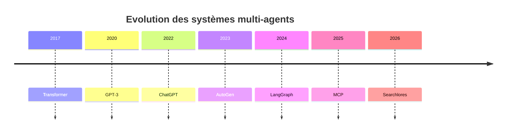
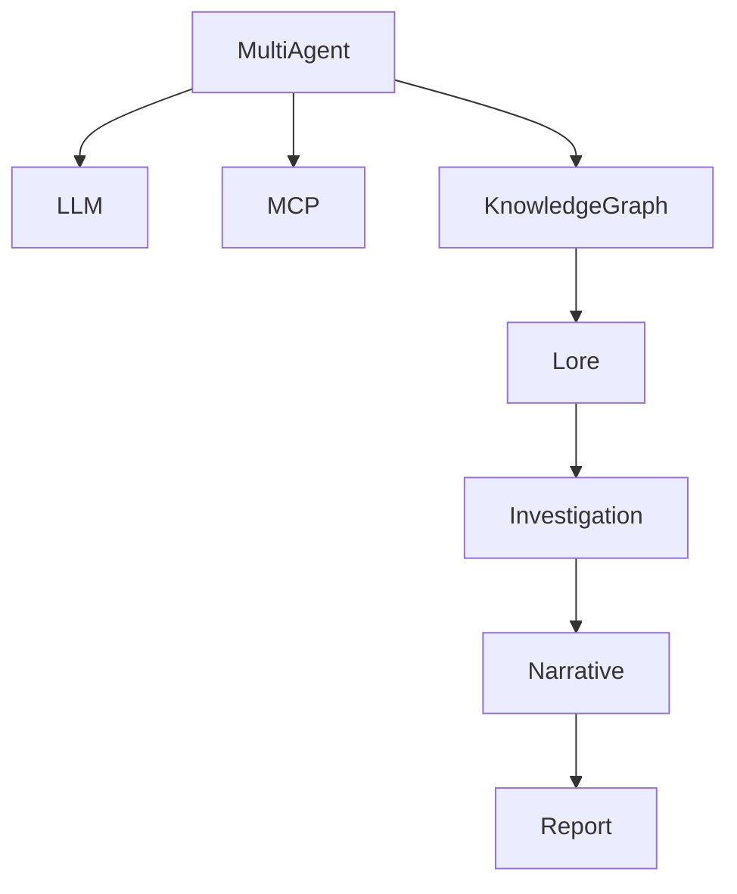

# Chapitre 12 — Construire sa première Investigation : un voyage complet dans Searchlores

> *« Un framework ne se comprend vraiment que lorsqu'on construit quelque chose avec lui. »*

---

# Oublier ses réflexes

Avant même d'écrire la moindre ligne de code, il faut oublier une habitude très répandue.

Lorsque nous découvrons un framework IA, notre premier réflexe est souvent :

> « Comment appeler le LLM ? »

Avec Searchlores, cette question est presque hors sujet.

La bonne question devient :

> **Quelle connaissance souhaitons-nous construire ?**

Ce n'est pas un détail.

C'est toute la philosophie du framework.

---

# Notre cas d'étude

Imaginons une véritable enquête.

Nous voulons répondre à une question qui revient sans cesse depuis deux ans.

> **Pourquoi les systèmes Multi-Agent prennent-ils autant d'importance ?**

Cette question paraît simple.

En réalité, elle est immense.

Elle implique :

* l'évolution des LLM ;
* les architectures distribuées ;
* les protocoles MCP ;
* les graphes de connaissances ;
* les outils d'orchestration ;
* les limites des prompts.

Autrement dit...

un sujet parfait pour Searchlores.

---

# Étape 1 — Créer une Investigation

Dans un framework traditionnel, nous créerions probablement un agent.

Ici...

nous ouvrons une enquête.

Conceptuellement, cela ressemble à ceci.

```python
investigation = Investigation(
    title="Rise of Multi-Agent Systems",
    question="Pourquoi les architectures multi-agents deviennent-elles dominantes ?"
)
```

À ce stade...

aucun LLM n'a encore été appelé.

C'est volontaire.

Nous sommes encore dans la phase de formulation.

---

# Ce qui vient réellement d'être créé

L'objet Investigation est bien plus riche qu'il n'y paraît.

Il contient déjà :

```text
Identité

Question

Contexte

État

Historique

Hypothèses

Journal

Lore associé

Plugins disponibles
```

Autrement dit,

nous venons de créer...

un espace de raisonnement.

---

# Étape 2 — Définir le Lore initial

Une enquête ne part jamais complètement de zéro.

Nous possédons déjà certaines connaissances.

Par exemple :

```yaml
Concepts connus

- LLM
- GPT
- Agent
- Tool
- MCP
- RAG
```

Nous pouvons également déclarer quelques relations.

```yaml
Agent

depends_on

LLM

RAG

provides

Context

Prompt

controls

Model
```

Le Lore possède déjà une première géographie.

---

# Étape 3 — Déclarer les hypothèses

Voici probablement l'étape la plus originale.

Au lieu de demander immédiatement une réponse,

nous écrivons ce que nous soupçonnons.

```yaml
Hypothesis 1

Les LLM sont devenus suffisamment fiables.

Hypothesis 2

Le contexte dépasse désormais la fenêtre mémoire.

Hypothesis 3

Les graphes remplacent progressivement les chaînes.
```

Ces hypothèses ne sont pas vraies.

Pas encore.

Elles attendent leurs preuves.

---

# Étape 4 — Choisir les méthodes d'investigation

Le moteur réfléchit ensuite.

Quels outils seront nécessaires ?

Imaginons.

```text
GitHub

ArXiv

Web

Documentation

Knowledge Graph

Timeline
```

Cette sélection est importante.

Elle constitue en quelque sorte...

la méthodologie scientifique de l'enquête.

---

# Étape 5 — Les plugins commencent à travailler

À partir de maintenant,

plusieurs investigations secondaires apparaissent.

Le plugin GitHub explore :

* LangGraph
* CrewAI
* AutoGen
* Searchlores

Le plugin Papers consulte :

* articles scientifiques
* publications
* benchmarks

Le plugin Documentation examine :

* API
* tutoriels
* RFC

Pendant ce temps...

le moteur reste totalement indépendant.

---

# Étape 6 — Les premières preuves

Les plugins commencent à produire des observations.

Pas des réponses.

Des observations.

Par exemple.

```text
Evidence

LangGraph introduit une orchestration orientée graphe.

Source

GitHub

Confiance

Haute
```

Puis une autre.

```text
Evidence

Les architectures multi-agents réduisent les limites du contexte.

Source

Article scientifique

Confiance

Moyenne
```

Puis une troisième.

Le Lore commence déjà à évoluer.

---

# Étape 7 — Apparition des contradictions

C'est ici que Searchlores devient vraiment passionnant.

Imaginons deux preuves.

Première preuve.

```text
Les agents améliorent toujours les performances.
```

Deuxième preuve.

```text
Les agents introduisent une forte complexité.
```

Le moteur ne choisit pas immédiatement.

Il conserve :

les deux.

Une contradiction devient elle-même un objet d'investigation.

Cette idée est remarquable.

---

# Étape 8 — L'Archéologie Cognitive

Le moteur commence alors à poser des questions.

Depuis quand parle-t-on d'agents ?

Pourquoi maintenant ?

Quels travaux ont préparé cette évolution ?

Quelles technologies sont apparues avant ?

Nous obtenons progressivement quelque chose comme :



La chronologie devient une preuve.

---

# Étape 9 — Le Lore s'enrichit

Chaque découverte modifie désormais la mémoire.

Le Lore commence à ressembler à ceci.



L'enquête laisse des traces durables.

---

# Étape 10 — La narration

Une fois les preuves suffisamment nombreuses,

le moteur peut enfin écrire.

Mais il n'écrit plus comme un LLM répondant à une question.

Il raconte une enquête.

La différence est immense.

Le rapport explique :

* ce qui était supposé ;
* ce qui a été confirmé ;
* ce qui reste incertain ;
* ce qui mérite une nouvelle investigation.

Nous ne lisons plus seulement une réponse.

Nous lisons...

l'histoire d'une découverte.

---

# Étape 11 — La fin...

...qui est en réalité un commencement

Lorsque le rapport est terminé,

beaucoup de frameworks détruisent tout.

Searchlores, lui,

fait exactement l'inverse.

Il conserve :

* les concepts ;
* les preuves ;
* les relations ;
* les chronologies ;
* les graphes ;
* les contradictions.

La prochaine investigation commencera ici.

---

# Ce qui change réellement pour un développeur

Après avoir suivi cette enquête, on réalise que développer avec Searchlores consiste moins à écrire du code qu'à **concevoir un protocole d'investigation**.

Les questions qui émergent ne sont plus :

* Quel modèle vais-je appeler ?
* Quel prompt dois-je écrire ?

Elles deviennent :

* Quelle hypothèse mérite d'être testée ?
* Quelles sources permettront de la confirmer ou de l'infirmer ?
* Comment relier cette nouvelle connaissance au Lore existant ?
* Sous quelle forme cette connaissance sera-t-elle la plus utile demain ?

Ce déplacement du centre de gravité est probablement la plus grande richesse du framework.

---

# Un cas d'usage concret : la veille technologique

À mesure que j'écrivais ce chapitre, un scénario d'utilisation s'est imposé.

Imaginons une équipe d'architecture logicielle chargée de suivre l'évolution de l'écosystème IA.

Chaque semaine, une investigation est lancée :

* nouvelles publications scientifiques ;
* nouveaux frameworks ;
* nouvelles versions des modèles ;
* nouveaux protocoles comme MCP ;
* nouveaux outils open source.

Au lieu de produire une succession de comptes rendus oubliés quelques jours plus tard, Searchlores construirait progressivement un **Lore vivant** de l'écosystème.

Six mois plus tard, l'équipe ne disposerait pas seulement d'une archive de rapports. Elle posséderait une mémoire structurée, interrogeable et continuellement enrichie.

C'est exactement le type de problème où l'approche de Searchlores prend tout son sens.

---

# Ce que Searchlores n'est probablement pas

Cette immersion pratique permet aussi de comprendre les limites naturelles du framework.

Si ton objectif est simplement :

* appeler GPT ;
* résumer un PDF ;
* traduire un texte ;
* créer un chatbot.

Alors Searchlores est probablement disproportionné.

Il introduit volontairement des concepts — Investigation, Lore, Evidence, Narrative — qui n'apportent leur valeur que lorsque la connaissance devient un actif durable.

En revanche, dès que les investigations s'enchaînent, que les résultats doivent être capitalisés et que plusieurs personnes collaborent autour d'un même domaine, cette architecture commence à révéler toute sa puissance.

---

# Une réflexion personnelle

En terminant ce chapitre, j'ai réalisé que Searchlores me faisait penser à un **laboratoire de recherche** plus qu'à un framework IA.

Dans un laboratoire :

* on formule des hypothèses ;
* on collecte des observations ;
* on confronte des preuves ;
* on documente les résultats ;
* on construit progressivement une théorie.

Searchlores transpose exactement cette méthode dans une architecture logicielle.

Et c'est sans doute la raison pour laquelle il donne une impression si différente des frameworks d'agents traditionnels.

---

# Conclusion

Nous venons de parcourir une investigation complète, depuis la formulation d'une question jusqu'à l'enrichissement durable du Lore. Pour la première fois, tous les concepts étudiés dans les chapitres précédents se sont mis à fonctionner ensemble : les hypothèses ont guidé les recherches, les plugins ont produit des preuves, l'archéologie a apporté de la profondeur, le graphe a structuré les relations et la narration a transformé cette matière brute en un récit intelligible.

À partir du **chapitre 13**, nous allons changer une dernière fois de perspective. Nous ne regarderons plus Searchlores de l'intérieur, mais **face à ses concurrents**. Nous le comparerons en profondeur à LangChain, LangGraph, CrewAI, AutoGen, Haystack, LlamaIndex et aux approches RAG classiques. L'objectif ne sera pas de désigner un vainqueur, mais de comprendre **où Searchlores apporte réellement quelque chose de nouveau**, où il reprend des idées existantes et dans quels contextes il constitue — ou non — le meilleur choix architectural. C'est probablement le chapitre qui permettra au lecteur de situer définitivement Searchlores dans le paysage actuel de l'IA.
