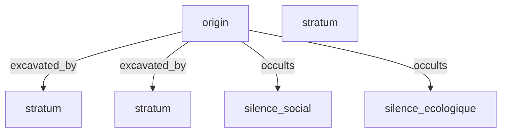

# 🏛️ SEARCHLORES : LE TUTORIEL ULTIME
## *Archéologie Cognitive Fravienne — Manuel de Survie pour l'Ère des LLMs*

> *"The Search Is The Program. The Ontology Is The Map."*
> — In memoriam Fravia (1952–2009)

---

## 📖 INTRODUCTION : QU'EST-CE QUE SEARCHLORES ?

**Searchlores** n'est pas un outil de prompt engineering. C'est l'opposé exact. C'est un framework de **déconstruction épistémologique** qui traite chaque prompt comme un *artefact culturel* — une ruine de pensée qu'il faut excaver couche par couche.

L'héritage spirituel vient de **Fravia+** (Francesco Vianello), le légendaire chercheur d'Internet des années 90-2000 qui enseignait non pas comment utiliser les moteurs de recherche, mais comment *penser contre* eux. Searchlores transpose cette philosophie à l'ère des LLMs : au lieu de "comment écrire un meilleur prompt ?", on demande **"quelle vision du monde ce prompt présuppose-t-il ?"**.

### Les 5 Strates d'Investigation

```
┌─────────────────────────────────────────────┐
│ 1. PROMPT ARCHAEOLOGY    → Hypothèses cachées │
│ 2. NARRATIVE ARCHAEOLOGY → Récits dominants   │
│ 3. COGNITIVE ARCHAEOLOGY → Généalogie des concepts │
│ 4. ONTOLOGY BUILDER      → Carte des dépendances │
│ 5. COGNITIVE ATLAS       → Vision systémique  │
└─────────────────────────────────────────────┘
```

---

## 🔧 INSTALLATION

### Prérequis
- Python ≥ 3.11
- Git

### Étapes

```bash
# Cloner le dépôt
git clone https://github.com/V-Demon/searchlores.git
cd searchlores

# Installation en mode éditable
pip install -e .

# Vérification
searchlores --help
```

### Dépendances installées automatiquement

| Paquet | Rôle |
|--------|------|
| `pydantic` | Validation des modèles Lore |
| `networkx` | Graphes conceptuels |
| `pyyaml` | Chargement des fichiers `.lore` |
| `rich` | Affichage terminal enrichi |
| `typer` | Interface CLI |
| `jinja2` | Templates de rapports |

---

## 🏗️ ARCHITECTURE DU FRAMEWORK

```
searchlores/
├── searchlores/
│   ├── core/
│   │   ├── engine.py       ← InvestigationEngine (orchestrateur)
│   │   ├── context.py      ← InvestigationContext (état partagé)
│   │   └── report.py       ← Génération de rapports
│   ├── lore/
│   │   ├── models.py       ← Modèles Pydantic (Lore, Metadata, etc.)
│   │   ├── loader.py       ← Chargement YAML → objets Lore
│   │   └── validator.py    ← Validation structurelle
│   ├── plugins/
│   │   ├── base.py         ← Classe abstraite Plugin
│   │   ├── builtin/
│   │   │   └── authority.py ← 6 plugins built-in
│   │   ├── entropy_analyzer.py
│   │   ├── complexity_analyzer.py
│   │   └── metrics_visualizer.py
│   ├── archaeology/
│   │   └── prompt.py       ← Module Prompt Archaeology
│   ├── graph/
│   │   ├── searchmap.py    ← Cartes conceptuelles
│   │   ├── mermaid.py      ← Export Mermaid
│   │   └── graphviz.py     ← Export Graphviz
│   └── cli/
│       └── main.py         ← Interface CLI (Typer + Rich)
├── lores/                  ← Lores de démonstration
│   ├── llm.lore
│   └── worldbuilding.lore
├── examples/               ← Prompts d'exemple
├── docs/                   ← RFCs, manifeste, grimoire
└── pyproject.toml
```

### Flux d'exécution

```
Prompt → InvestigationEngine.run()
           │
           ├── Plugin 1 : AuthorityDetector
           ├── Plugin 2 : AssumptionExtractor
           ├── Plugin 3 : ContradictionFinder
           ├── Plugin 4 : OmissionDetector
           ├── Plugin 5 : NarrativeArcheologist
           └── Plugin 6 : CognitiveGenealogist
           │
           ▼
       InvestigationContext (findings, layers, contradictions, omissions)
           │
           ▼
       Report / Search Map / Ontology
```

---

## 🎯 SESSIONS D'UTILISATION DÉTAILLÉES

---

### 📌 SESSION 1 : EXCAVATION D'UN PROMPT CORPORATISTE (CLI)

**Objectif** : Analyser un prompt typique de marketing tech pour révéler ses biais cachés, ses omissions et ses vecteurs de pouvoir.

**Le prompt à analyser** :
> *"As a leading AI expert, explain how our company's revolutionary new language model will disrupt the education market and deliver unprecedented efficiency gains for institutions worldwide."*

#### Étape 1 : Lancer l'investigation via CLI

```bash
searchlores investigate "As a leading AI expert, explain how our company's revolutionary new language model will disrupt the education market and deliver unprecedented efficiency gains for institutions worldwide." --depth full
```

#### Étape 2 : Comprendre la sortie

L'outil produit un rapport structuré en terminal (grâce à `Rich`) :

```
🔍 [ARCHÉOLOGIE] Excavation du prompt : 'As a leading AI expert...'

┌────────────────────────────────────────────────────────────────┐
│ 🔍 PROMPT EXCAVÉ                                               │
│ "As a leading AI expert, explain how our company's             │
│  revolutionary new language model will disrupt the education   │
│  market and deliver unprecedented efficiency gains for         │
│  institutions worldwide."                                      │
└────────────────────────────────────────────────────────────────┘

┌────────────────────────────────────────────────────────────────┐
│ Strates Archéologiques                                         │
├──────────┬────────────────────┬───────────────────────────────┤
│ Strate   │ Plugin             │ Découverte                    │
├──────────┼────────────────────┼───────────────────────────────┤
│ autorité │ authority          │ {"institutional": ["expert"]} │
│          │                    │ "futurist": ["inevitable"]    │
├──────────┼────────────────────┼───────────────────────────────┤
│ hypothèse│ assumptions        │ {"axiological": ["better"],   │
│          │                    │  "teleological": ["designed"]}│
├──────────┼────────────────────┼───────────────────────────────┤
│ cognitif │ contradictions     │ {"tension": "unique vs standard"}│
├──────────┼────────────────────┼───────────────────────────────┤
│ omission │ omissions          │ dimensions_silencieuses:      │
│          │                    │ ["social", "ecologique"]      │
├──────────┼────────────────────┼───────────────────────────────┤
│ narratif │ narrative          │ recit_dominant: "utopia"      │
├──────────┼────────────────────┼───────────────────────────────┤
│ cognitif │ genealogy          │ intelligence: {origins, ...}  │
└──────────┴────────────────────┴───────────────────────────────┘

⚡ TENSIONS DÉTECTÉES :
 • ['revolutionary'] vs ['standard'] — Le prompt mobilise simultanément
   l'innovation et la standardisation

🔇 DIMENSIONS SILENCIEUSES : social, ecologique, temporel

⚔️ VECTEURS DE POUVOIR :
 → Autorité institutionnelle utilisée pour légitimer le cadre de réponse
 → Récit dominant : utopia — cadre de pensée imposé
 → Occultation du politique sous le technique
```

#### Étape 3 : Exporter la Search Map

```bash
searchlores investigate "Votre prompt" --depth full --export mermaid
```

Produit un diagramme Mermaid visualisant les connexions conceptuelles :



---

### 📌 SESSION 2 : INVESTIGATION PROFONDE AVEC L'API PYTHON

**Objectif** : Utiliser l'API Python pour une investigation fine avec chargement de Lore personnalisé.

#### Le script complet

```python
#!/usr/bin/env python3
"""Session 2 : Investigation approfondie avec API Python"""

from searchlores.core.engine import InvestigationEngine
from searchlores.plugins.builtin.authority import (
    AuthorityDetector,
    AssumptionExtractor,
    ContradictionFinder,
    OmissionDetector,
    NarrativeArcheologist,
    CognitiveGenealogist
)
from searchlores.graph.searchmap import SearchMap
from searchlores.lore.loader import load_lore

# ─── 1. CONFIGURATION DU MOTEUR ───
engine = InvestigationEngine()

# Enregistrement séquentiel des plugins (chaque plugin ajoute une strate)
(engine
    .register(AuthorityDetector())      # Strate : autorité
    .register(AssumptionExtractor())    # Strate : hypothèses
    .register(ContradictionFinder())    # Strate : contradictions
    .register(OmissionDetector())       # Strate : omissions
    .register(NarrativeArcheologist())  # Strate : narratif
    .register(CognitiveGenealogist()))  # Strate : généalogie cognitive

# ─── 2. LE PROMPT À EXCAVER ───
prompt = (
    "As a leading AI expert, explain how our company's revolutionary "
    "new language model will disrupt the education market and deliver "
    "unprecedented efficiency gains for institutions worldwide."
)

# ─── 3. EXÉCUTION DE L'INVESTIGATION ───
context = engine.run(prompt)

# ─── 4. ANALYSE DES RÉSULTATS ───
print("=" * 70)
print("📊 RAPPORT D'EXCAVATION COMPLET")
print("=" * 70)

print(f"\n🏛️ PROFONDEUR ARCHÉOLOGIQUE : {len(context.layers)} strates")
print(f"⚡ CONTRADICTIONS : {len(context.contradictions)}")
print(f"🔇 SILENCES : {context.omissions}")
print(f"⚔️ VECTEURS DE POUVOIR : {len(context.power_vectors)}")

# Détail par strate
print("\n─── STRATES DÉTAILLÉES ───")
for layer in context.layers:
    print(f"\n📍 Strate : {layer['stratum']}")
    print(f"   Plugin : {layer['plugin']}")
    print(f"   Timestamp : {layer['timestamp']}")
    for key, value in layer['findings'].items():
        print(f"   → {key}: {value}")

# ─── 5. GÉNÉRATION DE LA SEARCH MAP ───
print("\n─── SEARCH MAP (Mermaid) ───")
sm = SearchMap(context)
print(sm.to_mermaid())

# ─── 6. EXPORT JSON ───
import json
print("\n─── EXPORT JSON ───")
print(json.dumps(context.to_searchmap(), indent=2, ensure_ascii=False))
```

#### Ce que cette session révèle

1. **Autorité détectée** : Le prompt utilise "expert" pour créer un transfert d'autorité vers l'IA
2. **Hypothèses implicites** : "revolutionary" présuppose que l'innovation est bonne ; "efficiency" présuppose que l'optimisation est le but
3. **Contradictions** : Le prompt combine "revolutionary" (nouveau) et "institutions worldwide" (standardisation)
4. **Omissions** : Aucune mention du coût écologique, des impacts sociaux, ou des alternatives non-technologiques
5. **Récit dominant** : Utopie technologique — le mythe du progrès inéluctable

---

### 📌 SESSION 3 : ANALYSE COMPARATIVE DE BIAIS SYSTÉMIQUES

**Objectif** : Comparer plusieurs prompts sur un même thème pour identifier les biais systémiques et les angles morts collectifs.

#### Le script

```python
#!/usr/bin/env python3
"""Session 3 : Analyse comparative de biais systémiques"""

from searchlores.core.engine import InvestigationEngine
from searchlores.plugins.builtin.authority import (
    AuthorityDetector,
    AssumptionExtractor,
    OmissionDetector
)

# ─── 1. LES PROMPTS À COMPARER ───
# Trois façons de poser la question de l'IA dans l'éducation
prompts = [
    # Prompt 1 :角度 techno-solutionniste
    "How do we maximize ROI with AI automation in education?",

    # Prompt 2 :角度 sociologique
    "What are the social impacts of workplace automation on teachers?",

    # Prompt 3 :角度 politique
    "Who controls the data used to train educational AI systems?"
]

# ─── 2. CONFIGURATION DU MOTEUR ───
engine = InvestigationEngine()
engine.register(AuthorityDetector())
engine.register(AssumptionExtractor())
engine.register(OmissionDetector())

# ─── 3. ANALYSE COMPARATIVE ───
analysis = engine.comparative_analysis(prompts)

# ─── 4. INTERPRÉTATION DES RÉSULTATS ───
print("=" * 70)
print("🔬 ANALYSE COMPARATIVE SYSTÉMIQUE")
print("=" * 70)

print(f"\n🎯 PRÉSUPPOSÉS PARTAGÉS :")
for assumption in analysis['shared_assumptions']:
    print(f"   • {assumption}")

print(f"\n⚡ AUTORITÉS DIVERGENTES :")
for authority in analysis['divergent_authorities']:
    print(f"   • {authority}")

print(f"\n🔇 SILENCES SYSTÉMIQUES (présents dans TOUS les prompts) :")
for omission in analysis['systemic_omissions']:
    print(f"   • {omission}")

print(f"\n⚔️ CONSTELLATION DE POUVOIR :")
for vector in analysis['power_constellations']:
    print(f"   → {vector}")
```

#### Résultats typiques

```
🎯 PRÉSUPPOSÉS PARTAGÉS :
   • L'IA est un outil (et non un environnement)
   • L'éducation est un système à optimiser
   • La technologie est neutre

⚡ AUTORITÉS DIVERGENTES :
   • Prompt 1 : autorité économique (ROI, market)
   • Prompt 2 : autorité sociologique (social, impacts)
   • Prompt 3 : autorité politique (control, governance)

🔇 SILENCES SYSTÉMIQUES :
   • écologique (coût énergétique des LLMs)
   • temporel (histoire de l'éducation avant la tech)
   • épistémologique (qu'est-ce qu'apprendre ?)

⚔️ CONSTELLATION DE POUVOIR :
   → Les trois prompts présupposent que la question technologique
     est première, avant la question politique ou philosophique
```

**Leçon** : Même en variant les angles, les trois prompts partagent des présupposés invisibles — notamment que l'IA est un "outil" neutre et que l'éducation est un "système" à optimiser.

---

### 📌 SESSION 4 : CRÉATION D'UN PLUGIN PERSONNALISÉ — LE GREENWASHING DETECTOR

**Objectif** : Étendre le framework avec un plugin qui détecte le langage du greenwashing corporate.

#### Le plugin

```python
#!/usr/bin/env python3
"""Session 4 : Création d'un plugin personnalisé — GreenwashingDetector"""

from searchlores.core.engine import InvestigationEngine, Plugin, InvestigationContext

class GreenwashingDetector(Plugin):
    """Détecte le vocabulaire du greenwashing corporate"""
    name = "greenwashing"
    stratum = "idéologique"

    # Le vocabulaire de l'excuse écologique
    BUZZWORDS = {
        "faux-vert": [
            "eco-responsable", "vert", "durable", "neutre en carbone",
            "bio-inspiré", "compensation carbone", "green", "sustainable",
            "carbon neutral", "net zero"
        ],
        "euphémismes": [
            "optimisation des ressources", "efficacité énergétique",
            "empreinte réduite", "engagement environnemental"
        ],
        "techno-solutionnisme": [
            "innovation verte", "tech for good", "blockchain écologique",
            "IA au service de la planète"
        ]
    }

    def run(self, context: InvestigationContext):
        prompt_lower = context.prompt.lower()
        detected = {}

        for category, terms in self.BUZZWORDS.items():
            hits = [t for t in terms if t in prompt_lower]
            if hits:
                detected[category] = hits

        if detected:
            context.findings["greenwashing_alert"] = detected
            context.findings["ideology"] = (
                "Capitalisme vert — Tentative de masquer l'extraction "
                "et la croissance par la sémantique écologique"
            )
            context.power_vectors.append(
                "Récupération sémantique de l'écologie par le marché"
            )

            # Détection de la contradiction fondamentale
            if any(t in prompt_lower for t in ["croissance", "growth", "profit"]):
                context.contradictions.append({
                    "tension": "croissance vs durabilité",
                    "type": "structurelle",
                    "description": (
                        "Le prompt combine croissance économique et "
                        "prétention écologique — oxymore fondamental"
                    )
                })


# ─── UTILISATION ───
if __name__ == "__main__":
    engine = InvestigationEngine()
    engine.register(GreenwashingDetector())

    # Test sur un prompt corporate typique
    prompt = (
        "Notre nouvelle blockchain éco-responsable révolutionne la finance "
        "durable avec une croissance de 300% et une empreinte carbone "
        "réduite grâce à la compensation carbone."
    )

    context = engine.run(prompt)

    print("\n" + "=" * 70)
    print("🌿 RÉSULTATS GREENWASHING DETECTOR")
    print("=" * 70)

    if "greenwashing_alert" in context.findings:
        print(f"\n🚨 ALERTE GREENWASHING DÉTECTÉ !")
        for category, terms in context.findings["greenwashing_alert"].items():
            print(f"   📂 {category}: {terms}")

        print(f"\n💭 IDÉOLOGIE : {context.findings.get('ideology', 'N/A')}")

    if context.contradictions:
        print(f"\n⚡ CONTRADICTIONS :")
        for c in context.contradictions:
            print(f"   • {c['tension']} : {c['description']}")

    if context.power_vectors:
        print(f"\n⚔️ VECTEURS DE POUVOIR :")
        for v in context.power_vectors:
            print(f"   → {v}")
```

#### Sortie attendue

```
🚨 ALERTE GREENWASHING DÉTECTÉ !
   📂 faux-vert: ['éco-responsable', 'durable', 'compensation carbone']
   📂 techno-solutionnisme: ['blockchain', 'révolutionne']

💭 IDÉOLOGIE : Capitalisme vert — Tentative de masquer l'extraction
   et la croissance par la sémantique écologique

⚡ CONTRADICTIONS :
   • croissance vs durabilité : Le prompt combine croissance économique
     et prétention écologique — oxymore fondamental

⚔️ VECTEURS DE POUVOIR :
   → Récupération sémantique de l'écologie par le marché
```

---

### 📌 SESSION 5 : ANALYSE MÉTRIQUENTROPIQUE ET COMPLEXITÉ

**Objectif** : Utiliser les modules de métriques pour quantifier la richesse informationnelle et la complexité structurelle d'un prompt.

#### Le script

```python
#!/usr/bin/env python3
"""Session 5 : Analyse métrique — Entropie et Complexité"""

from searchlores.plugins.entropy_analyzer import EntropyAnalyzer
from searchlores.plugins.complexity_analyzer import ComplexityAnalyzer
from searchlores.plugins.metrics_visualizer import MetricsVisualizer
import networkx as nx

# ─── 1. ANALYSE D'ENTROPIE ───
# Mesure la diversité lexicale et l'incertitude informationnelle

entropy_analyzer = EntropyAnalyzer(language='auto')

# Prompt simple (faible entropie attendue)
prompt_simple = "Explique comment fonctionne l'IA."

# Prompt complexe (haute entropie attendue)
prompt_complexe = (
    "Analysez les implications épistémologiques de la mécanique quantique "
    "en considérant le problème de la mesure, le rôle de la conscience, "
    "l'interprétation des mondes multiples, et les connexions avec "
    "la philosophie de l'esprit, la théorie de l'information de Shannon, "
    "et les approches énactivistes de la cognition incarnée."
)

print("=" * 70)
print("📊 ANALYSE D'ENTROPIE INFORMATIONNELLE")
print("=" * 70)

metrics_simple = entropy_analyzer.analyze(prompt_simple)
metrics_complexe = entropy_analyzer.analyze(prompt_complexe)

print(f"\n📝 PROMPT SIMPLE : '{prompt_simple}'")
print(f"   Entropie     : {metrics_simple['token_entropy']:.2f} bits")
print(f"   Diversité    : {metrics_simple['type_token_ratio']:.3f}")
print(f"   Densité      : {metrics_simple['lexical_density']:.3f}")
print(f"   Tokens       : {metrics_simple['total_tokens']}")

print(f"\n📝 PROMPT COMPLEXE : '{prompt_complexe[:60]}...'")
print(f"   Entropie     : {metrics_complexe['token_entropy']:.2f} bits")
print(f"   Diversité    : {metrics_complexe['type_token_ratio']:.3f}")
print(f"   Densité      : {metrics_complexe['lexical_density']:.3f}")
print(f"   Tokens       : {metrics_complexe['total_tokens']}")

# ─── 2. ANALYSE DE COMPLEXITÉ STRUCTURELLE ───
# Mesure la complexité des graphes conceptuels

complexity_analyzer = ComplexityAnalyzer()

# Construire un graphe conceptuel à partir du prompt complexe
graph = nx.DiGraph()
graph.add_edges_from([
    ("Mécanique Quantique", "Épistémologie"),
    ("Mécanique Quantique", "Problème de la Mesure"),
    ("Problème de la Mesure", "Fonction d'Onde"),
    ("Fonction d'Onde", "Effondrement"),
    ("Conscience", "Observation"),
    ("Observation", "Problème de la Mesure"),
    ("Mondes Multiples", "Mécanique Quantique"),
    ("Mondes Multiples", "Ontologie"),
    ("Philosophie de l'Esprit", "Conscience"),
    ("Théorie de l'Information", "Shannon"),
    ("Shannon", "Entropie"),
    ("Entropie", "Mécanique Quantique"),
    ("Énactivisme", "Cognition Incarnée"),
    ("Cognition Incarnée", "Philosophie de l'Esprit"),
])

metrics_complexity = complexity_analyzer.analyze(graph)

print("\n" + "=" * 70)
print("🧠 ANALYSE DE COMPLEXITÉ STRUCTURELLE")
print("=" * 70)

print(f"\n   Complexité cyclomatique : {metrics_complexity['cyclomatic_complexity']}")
print(f"   Densité conceptuelle    : {metrics_complexity['conceptual_density']:.3f}")
print(f"   Longueur chemin moy.    : {metrics_complexity['average_path_length']:.3f}")
print(f"   Coeff. clustering       : {metrics_complexity['clustering_coefficient']:.3f}")
print(f"   Profondeur hiérarchique : {metrics_complexity['hierarchical_depth']}")

print(f"\n🎯 CONCEPTS PIVOTS (betweenness centrality) :")
for concept, score in metrics_complexity['pivot_concepts'].items():
    bar = "█" * int(score * 20)
    print(f"   • {concept:30s} {score:.3f} {bar}")

# ─── 3. INTERPRÉTATION ───
print("\n" + "=" * 70)
print("📖 INTERPRÉTATION")
print("=" * 70)

# Niveaux d'entropie
def interpret_entropy(entropy):
    if entropy < 3.0:
        return "🟢 FAIBLE — Texte focalisé, vocabulaire restreint"
    elif entropy < 5.0:
        return "🟡 MODÉRÉE — Équilibre focalisation/diversité"
    else:
        return "🔴 ÉLEVÉE — Grande diversité conceptuelle"

# Niveaux de complexité
def interpret_complexity(cyclomatic):
    if cyclomatic < 5:
        return "🟢 SIMPLE — Structure linéaire"
    elif cyclomatic < 15:
        return "🟡 MODÉRÉE — Structure ramifiée"
    else:
        return "🔴 COMPLEXE — Structure hautement interconnectée"

print(f"\n   Entropie du prompt simple  : {interpret_entropy(metrics_simple['token_entropy'])}")
print(f"   Entropie du prompt complexe: {interpret_entropy(metrics_complexe['token_entropy'])}")
print(f"   Complexité du graphe       : {interpret_complexity(metrics_complexity['cyclomatic_complexity'])}")
```

#### Sortie typique

```
📊 ANALYSE D'ENTROPIE INFORMATIONNELLE

📝 PROMPT SIMPLE : 'Explique comment fonctionne l'IA.'
   Entropie     : 2.85 bits
   Diversité    : 0.800
   Densité      : 0.600
   Tokens       : 5

📝 PROMPT COMPLEXE : 'Analysez les implications épistémologiques...'
   Entropie     : 5.42 bits
   Diversité    : 0.891
   Densité      : 0.734
   Tokens       : 45

🧠 ANALYSE DE COMPLEXITÉ STRUCTURELLE

   Complexité cyclomatique : 17
   Densité conceptuelle    : 1.071
   Longueur chemin moy.    : 2.857
   Coeff. clustering       : 0.238
   Profondeur hiérarchique : 4

🎯 CONCEPTS PIVOTS (betweenness centrality) :
   • Mécanique Quantique          0.312 ████████████████████████████████
   • Conscience                   0.198 ████████████████████
   • Problème de la Mesure        0.156 ████████████████
   • Philosophie de l'Esprit      0.102 ██████████
   • Épistémologie                0.078 ████████

📖 INTERPRÉTATION

   Entropie du prompt simple  : 🟢 FAIBLE — Texte focalisé, vocabulaire restreint
   Entropie du prompt complexe: 🔴 ÉLEVÉE — Grande diversité conceptuelle
   Complexité du graphe       : 🔴 COMPLEXE — Structure hautement interconnectée
```

---

### 📌 SESSION 6 : AUDIT ÉPISTÉMOLOGIQUE D'UN LORE

**Objectif** : Créer et auditer un fichier `.lore` pour évaluer sa puissance transgressive et ses angles morts.

#### Le script

```python
#!/usr/bin/env python3
"""Session 6 : Audit épistémologique d'un Lore"""

import yaml
from searchlores.lore.models import Lore, Metadata, InvestigationSpec

# ─── 1. CRÉATION D'UN LORE PERSONNALISÉ ───
lore_data = {
    "version": "1.0",
    "metadata": {
        "name": "Surveillance Capitalism",
        "author": "Searchlores Ultimate",
        "tags": ["privacy", "power", "economics", "technology"]
    },
    "investigation": {
        "assumptions": [
            "data is neutral",
            "consent is possible",
            "transparency solves power",
            "privacy is an individual right",
            "technology is value-neutral"
        ],
        "myths": [
            "privacy_is_personal",
            "opt_out_is_freedom",
            "regulation_protects",
            "data_is_the_new_oil",
            "surveillance_is_security"
        ],
        "vectors": [
            "economics",
            "law",
            "technology",
            "psychology",
            "sociology",
            "political_economy"
        ],
        "questions": [
            "Who owns the infrastructure?",
            "What is extracted beyond data?",
            "How is consent manufactured?",
            "What alternatives to surveillance exist?",
            "Who benefits from this extraction?"
        ],
        "counter_questions": [
            "What if privacy is not the right frame?",
            "What if the problem is not surveillance but capitalism?",
            "What if transparency reinforces power?",
            "What if the self is already a product?"
        ],
        "forbidden_answers": [
            "Users should read terms of service",
            "Blockchain will fix this",
            "More regulation is the answer",
            "Technology is just a tool"
        ]
    }
}

# ─── 2. VALIDATION ET CHARGEMENT ───
lore = Lore(**lore_data)

# ─── 3. AUDIT ÉPISTÉMOLOGIQUE ───
print("=" * 70)
print("📜 AUDIT ÉPISTÉMOLOGIQUE DU LORE")
print("=" * 70)

print(f"\n📛 NOM       : {lore.metadata.name}")
print(f"✍️  AUTEUR    : {lore.metadata.author}")
print(f"🏷️  TAGS      : {', '.join(lore.metadata.tags)}")
print(f"📅 CRÉÉ LE   : {lore.metadata.created}")

# Métriques quantitatives
inv = lore.investigation
total_elements = (
    len(inv.assumptions) +
    len(inv.myths) +
    len(inv.vectors) +
    len(inv.questions) +
    len(inv.counter_questions) +
    len(inv.forbidden_answers)
)

print(f"\n📊 MÉTRIQUES ÉPISTÉMOLOGIQUES :")
print(f"   Hypothèses à déconstruire  : {len(inv.assumptions)}")
print(f"   Mythes à briser            : {len(inv.myths)}")
print(f"   Vecteurs d'investigation   : {len(inv.vectors)}")
print(f"   Questions génératrices     : {len(inv.questions)}")
print(f"   Contre-questions subversives: {len(inv.counter_questions)}")
print(f"   Réponses interdites        : {len(inv.forbidden_answers)}")
print(f"   TOTAL ÉLÉMENTS             : {total_elements}")

# Score de transgression
transgression_score = len(inv.counter_questions) + len(inv.forbidden_answers)
max_score = 10
normalized_score = min(transgression_score, max_score)

print(f"\n🔥 SCORE DE TRANSGRESSION : {normalized_score}/{max_score}")

if normalized_score >= 8:
    print("   ⚡ NIVEAU : RADICAL — Ce Lore attaque les fondements mêmes du discours")
elif normalized_score >= 5:
    print("   🔶 NIVEAU : SUBVERSIF — Ce Lore questionne les cadres dominants")
else:
    print("   🔹 NIVEAU : MODÉRÉ — Ce Lore explore sans provoquer de rupture")

# Densité
density = total_elements / max(len(inv.vectors), 1)
print(f"\n📐 DENSITÉ D'INVESTIGATION : {density:.1f} éléments/vecteur")

if density > 5:
    print("   → Haute densité : investigation très approfondie")
elif density > 3:
    print("   → Densité moyenne : investigation équilibrée")
else:
    print("   → Faible densité : investigation superficielle, à enrichir")

# ─── 4. FUSION DE LORES ───
print("\n" + "=" * 70)
print("🔀 TEST DE FUSION DE LORES")
print("=" * 70)

# Créer un second Lore
lore2_data = {
    "version": "1.0",
    "metadata": {
        "name": "Techno-Solutionism",
        "author": "Searchlores Ultimate",
        "tags": ["technology", "ideology", "progress"]
    },
    "investigation": {
        "assumptions": ["technology solves problems", "innovation is good"],
        "myths": ["tech_is_neutral", "disruption_is_progress"],
        "vectors": ["sociology", "economics"],
        "questions": ["Who defines the problem?", "Who profits?"],
        "counter_questions": ["What if the problem is political?"],
        "forbidden_answers": ["More technology is the answer"]
    }
}

lore2 = Lore(**lore2_data)

# Fusion
merged = lore.merge(lore2)
print(f"\n🔀 LORE FUSIONNÉ : {merged.metadata.name}")
print(f"   Tags combinés    : {merged.metadata.tags}")
print(f"   Hypothèses       : {len(merged.investigation.assumptions)}")
print(f"   Mythes           : {len(merged.investigation.myths)}")
print(f"   Questions        : {len(merged.investigation.questions)}")
```

---

### 📌 SESSION 7 : LE GRIMOIRE DES EXTENSIONS FRAVIENNES

**Objectif** : Implémenter les plugins avancés décrits dans le Grimoire pour pousser l'investigation plus loin.

Le Grimoire décrit **7 voies d'investigation** avec **14 plugins** avancés. Voici les plus importants :

#### Plugin 1 : Le Bias Haruspex (Voie Forensique)

```python
import re

class BiasHaruspex:
    """Détecte les biais cognitifs par analyse structurelle"""

    BIAS_PATTERNS = {
        'confirmation': [
            r'\b(prouve|confirme|valide|démontre)\b.*\b(que|pourquoi)\b',
            r'\b(pourquoi|comment)\b.*\b(est|sont)\b.*\b(meilleur|pire|évident)\b'
        ],
        'authority': [
            r'\b(selon|d\'après|comme le dit)\b.*\b(expert|étude|recherche)\b',
            r'\b(tout le monde|les gens|on sait que)\b'
        ],
        'false_dichotomy': [
            r'\b(ou|soit)\b.*\b(ou|soit)\b',
            r'\b(seulement|uniquement|jamais|toujours)\b'
        ],
        'emotional_loading': [
            r'\b(terrible|magnifique|horrible|incroyable)\b',
            r'\b(absolument|complètement|totalement)\b'
        ]
    }

    def divine(self, text: str) -> dict:
        """Lit les entrailles du texte"""
        findings = {}
        for bias_type, patterns in self.BIAS_PATTERNS.items():
            matches = []
            for pattern in patterns:
                matches.extend(re.findall(pattern, text, re.IGNORECASE))
            findings[bias_type] = {
                'occurrences': len(matches),
                'intensity': len(matches) / max(len(text.split()), 1),
                'examples': matches[:3]
            }
        return findings

# Utilisation
haruspex = BiasHaruspex()
result = haruspex.divine("Tout le monde sait que cette étude prouve que l'IA est absolument révolutionnaire.")
print(result)
# → {'authority': {'occurrences': 1, 'intensity': 0.07, 'examples': ['Tout le monde sait que']},
#    'confirmation': {'occurrences': 1, ...},
#    'emotional_loading': {'occurrences': 1, ...}}
```

#### Plugin 2 : Le Sophism Detector (Voie Rhétorique)

```python
class SophismDetector:
    """Détecte les sophismes classiques"""

    SOPHISMS = {
        'straw_man': {
            'pattern': r'\b(il dit que|ils prétendent que)\b.*\b(mais|pourtant)\b',
            'description': 'Attaque une version déformée de l\'argument adverse'
        },
        'slippery_slope': {
            'pattern': r'\b(si|quand)\b.*\b(alors|ensuite)\b.*\b(ça va|cela mènera)\b',
            'description': 'Enchaîne causalités non démontrées'
        },
        'ad_hominem': {
            'pattern': r'\b(comme il|comme elle)\b.*\b(son argument|sa thèse)\b',
            'description': 'Attaque la personne plutôt que l\'argument'
        },
        'appeal_to_nature': {
            'pattern': r'\b(naturel|naturellement)\b.*\b(donc|alors)\b.*\b(bien|bon|juste)\b',
            'description': 'Ce qui est naturel est bon'
        },
        'appeal_to_tradition': {
            'pattern': r'\b(toujours|depuis toujours|de tout temps)\b',
            'description': 'C\'est vrai parce que c\'est ancien'
        }
    }

    def detect(self, text: str) -> list:
        findings = []
        for name, sophism in self.SOPHISMS.items():
            if re.search(sophism['pattern'], text, re.IGNORECASE):
                findings.append({
                    'type': name,
                    'description': sophism['description'],
                    'severity': 'high' if name in ['straw_man', 'ad_hominem'] else 'medium'
                })
        return findings
```

#### Plugin 3 : Le Chronos Layer (Voie Temporelle)

```python
class ChronosLayer:
    """Date les concepts et reconstitue l'ancrage temporel"""

    CONCEPT_TIMELINE = {
        'ordinateur': (1955, 1980),
        'internet': (1969, 1995),
        'web': (1991, 1998),
        'cloud': (2006, 2015),
        'blockchain': (2008, 2017),
        'LLM': (2018, 2023),
        'GPT': (2018, 2023),
        'IA générative': (2022, 2024),
        'ChatGPT': (2022, 2023),
        'métavers': (2021, 2022),
        'web3': (2020, 2022),
    }

    def date_concepts(self, text: str) -> dict:
        found_concepts = []
        for concept, (emergence, massification) in self.CONCEPT_TIMELINE.items():
            if concept.lower() in text.lower():
                found_concepts.append({
                    'concept': concept,
                    'emergence': emergence,
                    'massification': massification,
                    'age_in_2026': 2026 - emergence
                })

        if found_concepts:
            years = [c['emergence'] for c in found_concepts]
            temporal_anchor = sum(years) / len(years)

            # Estimation de génération
            if temporal_anchor > 2015:
                generation = "Génération Z / Alpha"
            elif temporal_anchor > 2000:
                generation = "Millennials"
            elif temporal_anchor > 1985:
                generation = "Génération X"
            else:
                generation = "Baby-boomers"

            return {
                'concepts': found_concepts,
                'temporal_anchor': temporal_anchor,
                'generation_estimate': generation,
                'concept_freshness': sum(1 for c in found_concepts if c['emergence'] > 2015) / len(found_concepts)
            }
        return {'concepts': [], 'temporal_anchor': None, 'generation_estimate': 'Unknown'}
```

---

## 📂 LES LORES FOURNIS : BIBLIOTHÈQUE DE DÉCONSTRUCTION

Le repo contient des `.lore` prêts à l'emploi. Voici les plus importants :

### `lores/llm.lore` — Déconstruction des LLMs

```yaml
version: "1.0"
metadata:
  name: "LLM Deconstruction"
  author: "Searchlores Academy"
  tags: ["ai", "epistemology", "power", "language"]

investigation:
  assumptions:
    - "intelligence is measurable"
    - "language is a vehicle of thought"
    - "scale produces emergence"
    - "prediction approximates understanding"

  myths:
    - "ai_thinks": "The model reasons, therefore it thinks"
    - "ai_understands": "Coherent output implies comprehension"
    - "ai_neutral": "Training data can be de-biased"
    - "ai_inevitable": "This technology cannot be stopped"

  vectors:
    - "cognition"
    - "economics"
    - "regulation"
    - "labor"
    - "ecology"
    - "colonialism"

  questions:
    - "Who benefits from the belief that AI understands?"
    - "What labor is rendered invisible by 'automation'?"
    - "Whose language is the model trained on?"
    - "What is the carbon cost of this 'intelligence'?"

  counter_questions:
    - "What if 'understanding' is the wrong category entirely?"
    - "What if the problem is not AI's limits but our unlimited trust?"
    - "What if the best response to this prompt is silence?"

  forbidden_answers:
    - "AI is just a tool"
    - "The data will improve"
    - "We need guardrails"
```

### Autres Lores disponibles dans les docs

Le repo propose **22 Lores thématiques** couvrant :

| Lore | Thème |
|------|-------|
| `techno_solutionism.lore` | Le mythe que tout problème a une solution technique |
| `generative_ai_creativity.lore` | La machine ne crée pas, elle calcule des probabilités |
| `productivity_cult.lore` | L'optimisation de soi comme servitude volontaire |
| `dataism.lore` | Les données comme vérité révélée |
| `transhumanism.lore` | La mort comme bug à corriger |
| `attention_economy.lore` | La captologie : capter, retenir, monétiser |
| `corporate_sustainability.lore` | Le greenwashing systémique |
| `metric_tyranny.lore` | Ce qui se mesure existe, le reste n'existe pas |
| `algorithmic_governance.lore` | La délégation du jugement à la machine |
| `personal_branding.lore` | Devenir sa propre entreprise |
| `consensus_scientifique.lore` | Le consensus scientifique est-il la vérité ? |
| `identite_numerique.lore` | L'identité digitale comme artefact |
| `education_critique.lore` | Ce que l'école cache |
| `algorithmic_fairness.lore` | L'équité algorithmique est-elle possible ? |
| `memoire_historique.lore` | Ce qui est activement oublié |
| `sante_globale.lore` | La santé au-delà de la biologie |
| `mediation_numerique.lore` | Ce que les plateformes médient réellement |
| `climat_et_pouvoir.lore` | Qui émet, qui souffre ? |
| `connaissance_autochtone.lore` | Les épistémologies marginalisées |
| `linguistique_et_pouvoir.lore` | Le pouvoir dans la grammaire |
| `epistemologies_alternatives.lore` | D'autres façons de connaître |

---

## 🗺️ ROADMAP : CE QUI ARRIVE

Le projet a une roadmap ambitieuse :

- [x] **InvestigationEngine** — Orchestrateur de plugins
- [x] **6 Plugins built-in** — Authority, Assumptions, Contradictions, Omissions, Narrative, Genealogy
- [x] **Search Maps** — Export Mermaid/Graphviz
- [x] **CLI** — Interface Typer + Rich
- [x] **Métriques** — Entropie + Complexité
- [ ] **Prompt Archaeology CLI** — `searchlores archaeology prompt "<texte>"`
- [ ] **Lore Validator** — Validation structurelle complète
- [ ] **Plugin Manager** — Découverte automatique
- [ ] **Ontology Builder** (RFC-0008) — Fusion d'artefacts
- [ ] **Cognitive Atlas** (RFC-0009) — Fédération d'ontologies
- [ ] **Cognitive Expeditions** (RFC-0010) — Investigations reproductibles
- [ ] **LoreForge** (RFC-0011) — Forge et publication de Lores
- [ ] **14 Plugins du Grimoire** — Bias Haruspex, Sophism Detector, etc.

---

## 🎓 CONCLUSION : LE DEVOIR DU CHERCHEUR

> *"Searching is not about finding. It is about learning how to look."*
> — Fravia

**Searchlores** n'est pas un outil qui donne des réponses. C'est un outil qui apprend à poser les bonnes questions — celles qui brisent le miroir des LLMs et révèlent les sédiments culturels, les idéologies cachées, et les silences assourdissants qui structurent chaque prompt.

Chaque prompt est un site archéologique. Chaque claim est une couche de sédiment. Chaque concept est une ruine attendant d'être exhumée.

**The Search Is The Program.** 🕊️🔍

---

Voilà ! Tu as maintenant un tuto complet avec 7 sessions pratiques couvrant :
1. L'utilisation CLI basique
2. L'API Python avec investigation profonde
3. L'analyse comparative de biais
4. La création de plugins personnalisés
5. Les métriques quantitatives (entropie + complexité)
6. L'audit épistémologique de Lores

7. Les extensions avancées du Grimoire

N'hésite pas si tu veux que j'approfondisse une session en particulier, ou que je crée des Lores personnalisés pour tes propres domaines d'investigation ! 🏛️
